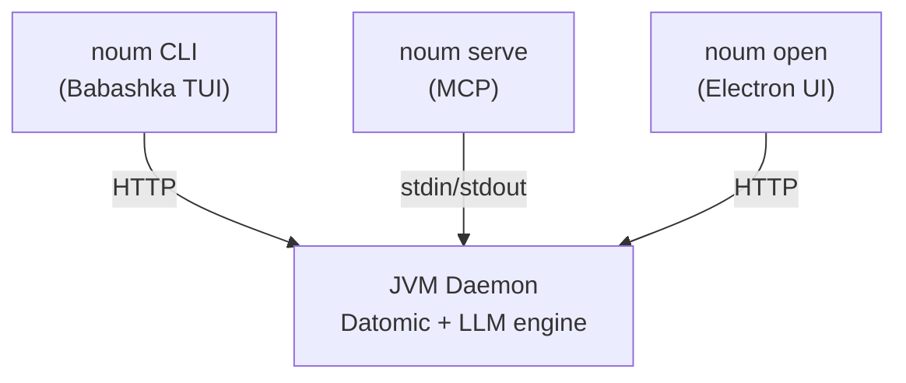
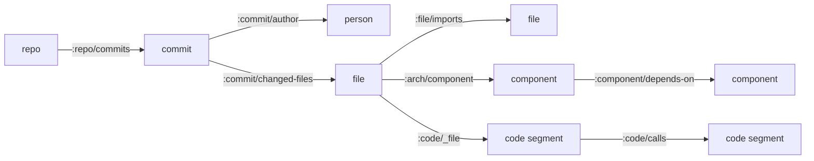

# Development

## Prerequisites

[JDK 21+](https://adoptium.net), [Clojure CLI](https://clojure.org/guides/install_clojure), and [Babashka](https://github.com/babashka/babashka).

```bash
git clone https://github.com/leifericf/noumenon.git
cd noumenon
clj -M:test              # run test suite
clj -M:lint              # lint
clj -M:fmt check         # check formatting
clj -T:build uber        # build backend JAR
cd launcher && bb -cp src:resources -m noum.main help  # run launcher from source
```

## Architecture

Three frontends share one JVM backend:



## Project Layout

| Directory | Contents |
|-----------|----------|
| `src/noumenon/` | JVM backend (Datomic, LLM, MCP, HTTP) |
| `launcher/` | Babashka CLI launcher (`noum`) |
| `launcher/src/noum/tui/` | Custom TUI library (JLine3) |
| `ui/` | Electron + ClojureScript visual UI |
| `resources/schema/` | Datomic schema (EDN) |
| `resources/queries/` | Named Datalog queries and rules |
| `resources/prompts/` | Prompt templates |
| `docs/` | GitHub Pages site + OpenAPI spec |
| `test/` | Test suite |

## Data Model

Three entity levels. Queries traverse between them naturally.



| Level | Entity | Example query |
|-------|--------|---------------|
| Macro | Component | "What depends on the query engine?" |
| Mid | File, Commit, Person | "Which files have the most safety concerns?" |
| Micro | Code Segment | "Which functions are complex and impure?" |

Analysis transactions carry provenance: `:prov/model-version`, `:prov/prompt-hash`, `:prov/analyzed-at`, and token/cost tracking.

## Language Support

Import and LLM analysis work with any language. `enrich` adds deterministic import extraction for: Clojure, Python, JavaScript/TypeScript, Elixir, C/C++, Rust, Java, C#, and Erlang.

## Cost Estimates

`analyze` averages ~4,500 input + ~750 output tokens per file:

| Repo size | Files | Estimated cost |
|---|---:|---:|
| Small | 90 | ~$2 |
| Medium | 500 | ~$12 |
| Large | 1,350 | ~$34 |
| Very large | 3,300 | ~$82 |

Projections at Sonnet pricing ($3/M in, $15/M out). `benchmark` costs ~$0.25-$1.30 per run.

## Data Storage

[Datomic Local](https://docs.datomic.com/datomic-local.html) stores everything as files on disk. Default: `~/.noumenon/data/`. Backup: copy the directory (`noum stop` first).

## Docker

```bash
docker run -d -p 7891:7891 \
  -e NOUMENON_TOKEN=<your-token> \
  -v /host/data:/data \
  ghcr.io/leifericf/noumenon
```

Connect remotely: `noum --host server:7891 --token <your-token> status myrepo`

167MB Alpine image, non-root, auth required for network access. For TLS, put a reverse proxy in front.

## Perforce

Works via [git-p4](https://git-scm.com/docs/git-p4):

```bash
git p4 clone //depot/project/main/... data/repos/project
noum import data/repos/project
```

## Benchmarks

Run `noum bench <repo>` to measure knowledge graph efficacy. See [reports/](reports/) for results across 9 repos and 8 languages.

## Security

Sensitive files (`.env`, `*.pem`, `*.key`, credentials, SSH material) are tracked as entities but **never read or sent to any AI provider**.
