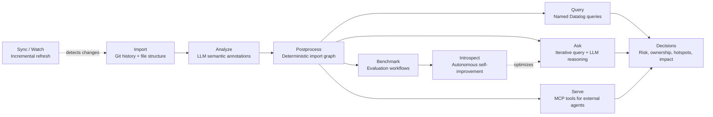
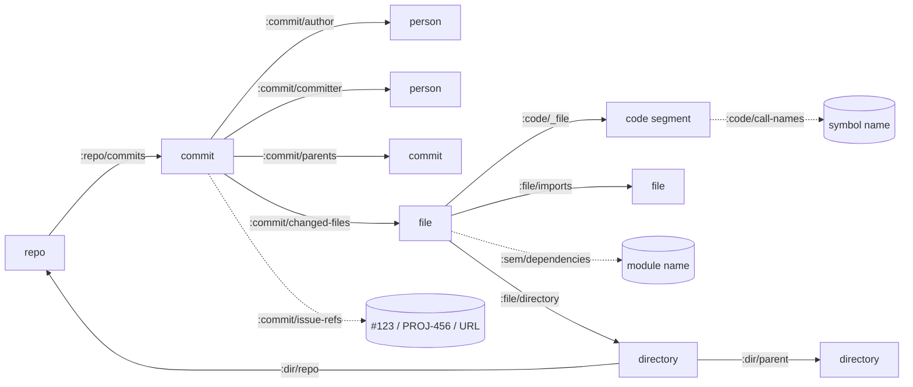
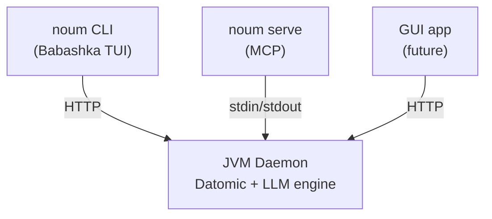

# Noumenon

[Datomic](https://www.datomic.com)-backed knowledge graph for codebase understanding. See [noumenon.leifericf.com](https://noumenon.leifericf.com) for an overview.

## Installation

### Quick install (macOS / Linux)

```bash
curl -sSL https://noumenon.leifericf.com/install | bash
```

Or via Homebrew:

```bash
brew install leifericf/noumenon/noumenon
```

Or download a binary directly from [GitHub Releases](https://github.com/leifericf/noumenon/releases):
`noum-macos-arm64`, `noum-macos-x86_64`, `noum-linux-arm64`, `noum-linux-x86_64`, `noum-windows-x86_64.exe`

The `noum` binary is self-contained — it automatically downloads a JRE and the Noumenon backend on first use. No Java knowledge required.

### Provider setup

Noumenon supports three LLM provider modes:

| Provider | Mode | What you need |
|---|---|---|
| `glm` (default) | HTTP API | `NOUMENON_ZAI_TOKEN` |
| `claude-api` | HTTP API | [`ANTHROPIC_API_KEY`](https://console.anthropic.com/settings/keys) |
| `claude-cli` (alias: `claude`) | Local CLI | [Claude Code](https://claude.ai/claude-code) installed and authenticated |

### Development setup

For contributing or running from source, see the [Development](#development) section.

## Quick Start

Use a local Git repo path or a Git URL.

### 1) Import deterministic facts

```bash
noum import /path/to/repo
# or:
noum import https://github.com/ring-clojure/ring.git
```

### 2) Run semantic analysis

```bash
noum analyze /path/to/repo --provider glm --model sonnet
```

### 3) (Optional) Build deterministic import graph

```bash
noum enrich /path/to/repo
```

### Keep the graph in sync

As the codebase changes, update the knowledge graph with the latest git state:

```bash
noum update /path/to/repo
noum watch /path/to/repo
```

`update` also works for first-time setup — it runs the full import if no database exists. On subsequent runs it detects HEAD changes and incrementally updates. The MCP server auto-syncs before queries.

### 4) Inspect status, databases, and queries

```bash
noum databases                              # list all imported repos
noum status myrepo                          # entity counts (use database name)
noum schema myrepo                          # show schema
noum queries                                # list available queries
noum query files-by-complexity /path/to/repo
```

### 5) Ask the graph a natural-language question

```bash
noum ask /path/to/repo "Which files are the biggest risk hotspots?"
```

## Pipeline Overview



`enrich` is optional but recommended for deterministic dependency and test-impact analysis. `update` replaces the manual `import` + `enrich` workflow. `introspect` uses benchmark results to autonomously improve the ask agent's prompts, examples, rules, and code.

## Command Reference

```bash
noum <command> [options]
noum help <command>
```

The `noum` CLI and [MCP](https://modelcontextprotocol.io) server expose the same capabilities.

| `noum` | MCP tool | Description |
|---|---|---|
| `import <repo>` | `noumenon_import` | Import git history and file structure |
| `analyze <repo>` | `noumenon_analyze` | Enrich files with LLM semantic metadata |
| `enrich <repo>` | `noumenon_enrich` | Extract cross-file import graph (no LLM) |
| `update <repo>` | `noumenon_update` | Sync knowledge graph with latest git state |
| `digest <repo>` | `noumenon_digest` | Full pipeline: import, enrich, analyze, benchmark |
| `ask <repo> "question"` | `noumenon_ask` | Ask a question using iterative Datalog querying |
| `query <name> <repo>` | `noumenon_query` | Run a named Datalog query |
| `queries` | `noumenon_list_queries` | List available named queries |
| `schema <repo>` | `noumenon_get_schema` | Show database schema |
| `status <repo>` | `noumenon_status` | Show entity counts |
| `databases` | `noumenon_list_databases` | List all databases with stats |
| `delete <name>` | -- | Delete a database |
| `bench <repo>` | `noumenon_benchmark_run` | Evaluate knowledge graph efficacy |
| `results [id]` | `noumenon_benchmark_results` | Get benchmark results |
| `compare <a> <b>` | `noumenon_benchmark_compare` | Compare two benchmark runs |
| `introspect <repo>` | `noumenon_introspect_start` | Autonomous self-improvement loop |
| `reseed` | `noumenon_reseed` | Reload prompts, queries, and rules |
| `history --type <t>` | `noumenon_artifact_history` | Show artifact change history |
| `watch <repo>` | -- | Auto-sync on new commits |
| `serve` | -- | Start MCP server (stdin/stdout) |
| `setup desktop` | -- | Configure MCP for Claude Desktop |
| `setup code` | -- | Write `.mcp.json` for Claude Code |
| `install claude` | -- | Install Claude Desktop and/or Code |
| `start` / `stop` / `ping` | -- | Manage the HTTP daemon |
| `upgrade` | -- | Update noumenon.jar and launcher |

## Named Queries

56 named Datalog queries live in `resources/queries/` (EDN), covering hotspots, ownership, dependencies, complexity, churn, impact analysis, issue tracking, LLM cost tracking, benchmarks, and introspect history. Run `noum queries` to see them all.

## Data Model

Noumenon combines four sources:

1. Git history (deterministic)
2. File structure (deterministic)
3. Semantic analysis (LLM)
4. Import graph extraction (`enrich`, deterministic)

### Entity Types

| Entity | Identity | Key attributes |
|---|---|---|
| `repo` | `:repo/uri` | `:repo/commits`, `:repo/head-sha` |
| `commit` | `:git/sha` (`:git/type :commit`) | `:commit/message`, `:commit/kind`, `:commit/issue-refs`, `:commit/authored-at`, `:commit/committed-at`, `:commit/additions`, `:commit/deletions` |
| `person` | `:person/email` | `:person/name` |
| `file` | `:file/path` | `:file/ext`, `:file/lang`, `:file/lines`, `:file/size`, `:file/imports`, `:sem/*` |
| `directory` | `:dir/path` | `:dir/parent`, `:dir/repo` |
| `code segment` | `:code/file+name` (tuple of `:code/file` + `:code/name`) | `:code/kind`, `:code/line-start`, `:code/line-end`, `:code/args`, `:code/returns`, `:code/visibility`, `:code/complexity`, `:code/smells`, `:code/call-names`, `:code/pure?`, `:code/ai-likelihood` |
| `tx metadata` | tx entity | `:tx/op`, `:tx/source`, `:tx/analyzer`, `:tx/model`, `:tx/input-tokens`, `:tx/output-tokens`, `:tx/cost-usd` |
| `provenance` | mixed (entity + tx metadata) | `:prov/confidence` on analyzed entities; `:prov/model-version`, `:prov/prompt-hash`, `:prov/analyzed-at` on analysis transactions |
| `component` (schema-defined) | `:component/name` | `:component/depends-on`, `:component/files` |

### Relationship Graph



`chunk` entities (`:chunk/parent`, `:chunk/index`, `:chunk/text`) handle long text values exceeding Datomic string limits. Component relationships (`:arch/component`, `:component/depends-on`) and resolved call edges (`:code/calls`) are schema-supported but not yet populated by the default pipeline.

## Language Support

Import and LLM analysis work with any language. `enrich` adds deterministic import extraction:

| Tier | Languages | Method | External tool |
|---|---|---|---|
| Full | Clojure | `tools.namespace` parsing + test mapping | none |
| Import extraction | Elixir | AST parser via `Code.string_to_quoted` | `elixir` |
| Import extraction | Python | `ast` parser | `python3` |
| Import extraction | JavaScript / TypeScript | Regex-based import extraction via Node runtime | `node` |
| Import extraction | C / C++ | compiler dependency output | `clang` or `gcc` |
| Import extraction | C# | `using` directive detection | none (regex) |
| Import extraction | Rust | `mod` detection | none (regex) |
| Import extraction | Java | `import` detection | none (regex) |
| Import extraction | Erlang | `-include` / `-include_lib` detection | none (regex) |
| Analysis only | many others | LLM-only semantics | n/a |

Markdown files are imported as entities but not analyzed.

### Sensitive File Protection

Files matching known sensitive patterns are **never read or sent to any AI provider**:

| Pattern | Examples |
|---|---|
| Environment files | `.env`, `.env.local`, `.env.production` (not `.env.example`) |
| Crypto keys | `*.pem`, `*.key`, `*.p12`, `*.pfx`, `*.keystore`, `*.jks`, `*.cert` |
| Credential files | `credentials.json`, `token.json`, `.npmrc`, `.pypirc`, `.netrc`, `.htpasswd`, `.pgpass` |
| SSH material | `.ssh/*`, `id_rsa*`, `id_ed25519*`, `id_ecdsa*` |

These files are still tracked as entities (path, size, extension) but their contents are never accessed.

**Note:** This covers well-known secret *files*. Secrets hardcoded in source code will still be sent to the LLM. Use [git-secrets](https://github.com/awslabs/git-secrets) or [gitleaks](https://github.com/gitleaks/gitleaks) to prevent secrets from entering your repo.

## MCP Server

Run Noumenon as an [MCP](https://modelcontextprotocol.io) server so AI agents can call it as a tool.

### Automatic setup

```bash
noum setup desktop    # Configure Claude Desktop
noum setup code       # Write .mcp.json for Claude Code
```

### Manual configuration

#### [Claude Desktop](https://claude.ai/download)

Add to `~/Library/Application Support/Claude/claude_desktop_config.json`:

```json
{
  "mcpServers": {
    "noumenon": {
      "command": "noum",
      "args": ["serve"]
    }
  }
}
```

#### [Claude Code](https://claude.ai/claude-code)

Add to `.mcp.json` (per-project) or `~/.claude/settings.json` (global):

```json
{
  "mcpServers": {
    "noumenon": {
      "command": "noum",
      "args": ["serve"]
    }
  }
}
```

## HTTP API

The daemon exposes a REST-ish HTTP API on localhost for the `noum` CLI and future GUI app. See [`docs/openapi.yaml`](docs/openapi.yaml) for the full OpenAPI 3.1 specification.

All long-running endpoints support [SSE](https://developer.mozilla.org/en-US/docs/Web/API/Server-sent_events) progress streaming via `Accept: text/event-stream`.

## Benchmarks

Run the benchmark on your own repo to measure whether the knowledge graph improves LLM answers about your codebase. See [reports/digest-run-2026-03-27.md](reports/digest-run-2026-03-27.md) for results from a full run across 9 repos and 8 languages.

## Cost Estimates

`analyze` averages roughly `~4,500` input + `~750` output tokens per file. Example projections using [Anthropic Sonnet pricing](https://docs.anthropic.com/en/docs/about-claude/models) (`$3/M` input, `$15/M` output):

| Repo size | Source files | Estimated cost |
|---|---:|---:|
| Small (Ring-scale) | 90 | ~$2 |
| Medium | 500 | ~$12 |
| Large (Redis-scale) | 1,350 | ~$34 |
| Very large (Guava-scale) | 3,300 | ~$82 |

`benchmark` costs ~$0.25-$1.30 per run depending on mode. Providers without per-token pricing (e.g. `glm`) still track token counts but report `$0.00`.

## Data Storage & Backup

Noumenon uses [Datomic Local](https://docs.datomic.com/datomic-local.html) — an embedded database that stores everything as files on disk. No external database server required.

**Default location:** `~/.noumenon/data/` (when using `noum`) or `data/datomic/` (when developing from source).

**Backup:** Copy the database directory. That's the [official approach](https://docs.datomic.com/datomic-local.html). Stop the daemon first for consistency (`noum stop`, copy, `noum start`).

**Docker:** Mount a volume at the data directory to persist databases across container restarts. A token is required for network access:

```bash
docker run -d -p 7891:7891 \
  -e NOUMENON_TOKEN=<your-token> \
  -v /host/data:/data \
  ghcr.io/leifericf/noumenon
```

Then connect from any machine: `noum --host server:7891 --token <your-token> status myrepo`

The image is 167MB (Alpine + custom jlink JRE), runs as non-root, and refuses to start without auth when network-accessible. For TLS, put a reverse proxy (Caddy, nginx) in front.

**Enterprise:** [Datomic Pro](https://www.datomic.com/get-datomic.html) (free) is available for deployments requiring a proper transactor with PostgreSQL or DynamoDB storage. The Noumenon codebase uses the same Datomic client API — switching is a configuration change, not a code change.

## Development

Requires [JDK 21+](https://adoptium.net), [Clojure CLI](https://clojure.org/guides/install_clojure), and [Babashka](https://github.com/babashka/babashka).

```bash
git clone https://github.com/leifericf/noumenon.git
cd noumenon
clj -M:test              # run test suite
clj -M:lint              # lint
clj -M:fmt check         # check formatting
clj -T:build uber        # build backend JAR
cd launcher && bb -cp src:resources -m noum.main help  # run launcher from source
```

## Architecture



## Project Layout

- `src/noumenon/` - JVM backend (Datomic, LLM, MCP, HTTP daemon)
- `launcher/` - Babashka CLI launcher (`noum` binary)
- `launcher/src/noum/tui/` - custom TUI library (JLine3)
- `resources/schema/` - Datomic schema (EDN)
- `resources/queries/` - named Datalog queries and rules
- `resources/prompts/` - prompt templates
- `docs/` - GitHub Pages site + OpenAPI spec
- `test/` - test suite
- `data/` - local runtime artifacts (ignored)

## Using with Perforce

Works with Helix Core via [git-p4](https://git-scm.com/docs/git-p4), which creates a local Git mirror from a P4 depot path.

**Requirements**: `git`, `p4`, and `git-p4` on PATH. Perforce environment (`P4PORT`, `P4USER`, `P4CLIENT`) configured.

### Import a Perforce depot

```bash
git p4 clone //depot/project/main/... data/repos/project
noum import data/repos/project
```

### Sync with new changelists

```bash
cd data/repos/project && git p4 sync && git p4 rebase && cd -
noum update data/repos/project
```

If your server has [Helix4Git](https://www.perforce.com/products/helix-core-git-connector), point Noumenon at the Git URL directly — no `git-p4` needed.

## Status

This project is under active development and currently optimized for CLI workflows.

This project was developed using [leifericf's Claude Code Toolkit](https://github.com/leifericf/claude-code-toolkit).

## License

MIT. See `LICENSE`.
