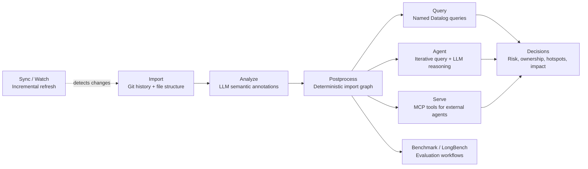
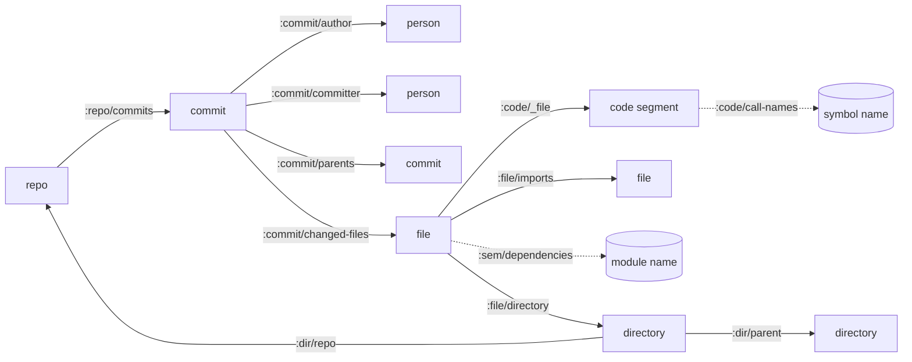

# Noumenon

Noumenon is a Datomic-backed knowledge graph for codebase understanding.

Instead of treating a repository as an opaque pile of files, Noumenon turns it into a living graph of relationships: commits, authors, files, code segments, architecture, and dependencies. It combines deterministic facts with semantic analysis so humans and agents can ask focused questions and get grounded answers fast. For AI agents, this enables surgical retrieval: fetch the exact entities and edges needed for a task instead of stuffing raw files into context windows, which can reduce token spend and avoid prompt bloat.

## Why Noumenon

Long-context prompting alone breaks down as repositories grow. Noumenon takes a different path: model the codebase as structured data you can query, audit, and reason over.

That structure gives agents a precise retrieval strategy: query first, pull only relevant facts, then reason. The result is designed to improve signal per token and lower context-window waste.

It blends three complementary layers:

- Deterministic facts from Git + filesystem structure
- Semantic annotations from model analysis
- Query-first exploration via Datomic + Datalog

That unlocks questions like:

- Which files are complexity hotspots?
- What files tend to co-change?
- Who are the primary contributors in a subsystem?
- What is the likely impact radius of a change?

And more complex questions such as:

- Which `:file/path` entities have both high `:commit/changed-files` frequency and `:sem/complexity` = `:very-complex`?
- For a target `:file/path`, what transitive `:file/imports` edges and reverse importers (`:file/_imports`) define its blast radius?
- Which `:code/file+name` segments are marked `:code/deprecated? true` but live in files with recent `:commit/committed-at` activity?
- Where do `:file/imports` edges cross `:arch/layer` boundaries, and which `:arch/component` pairs are most coupled?
- Which files combine `:code/safety-concerns`, low bus factor (few distinct `:commit/author`), and high fix-heavy history (`:commit/kind :fix`)?

## What you get

- A CLI-first workflow built for real repositories (`clj -M:run ...`)
- A Datomic knowledge graph per imported repo name, with stable identities
- Named EDN queries in `resources/queries/` for repeatable analysis
- Deterministic import graph extraction (`postprocess`) for impact tracing
- AI-powered `agent` mode that reasons by querying, not guessing
- Benchmark flows (`benchmark`, `longbench`) to measure quality and cost

## Requirements

- JDK 21+
- Clojure CLI (`clj`)
- Git
- Provider setup (depends on chosen provider)

### Provider setup

Noumenon supports three provider modes:

| Provider | Mode | What you need |
|---|---|---|
| `glm` (default) | HTTP API | `NOUMENON_ZAI_TOKEN` |
| `claude-api` | HTTP API | `ANTHROPIC_API_KEY` |
| `claude-cli` (alias: `claude`) | Local CLI | `claude` installed and authenticated |

Use `.env.example` as a template for local environment setup.

## Installation

### Option 1: Run from source (recommended)

```bash
git clone https://github.com/leifericf/noumenon.git
cd noumenon
clj -M:run --help
```

### Option 2: Standalone JAR

Download the latest JAR from [GitHub Releases](https://github.com/leifericf/noumenon/releases):

```bash
java -jar noumenon-0.1.0.jar --help
```

Build from source if needed:

```bash
clj -T:build uber
java -jar target/noumenon-0.1.0.jar --version
```

### Option 3: Use as a Clojure dependency

```clojure
{:aliases
 {:noumenon
  {:extra-deps {io.github.leifericf/noumenon {:git/tag "v0.1.0" :git/sha "d97bdac"}}
   :main-opts ["-m" "noumenon.main"]}}}
```

Then run:

```bash
clj -M:noumenon --help
```

## Quick Start

Use a local Git repo path or a Git URL.

### 1) Import deterministic facts

```bash
clj -M:run import /path/to/repo
# or:
clj -M:run import https://github.com/ring-clojure/ring.git
```

### 2) Run semantic analysis

```bash
clj -M:run analyze /path/to/repo --provider glm --model sonnet
```

During `analyze`, Noumenon prints token and cost telemetry to stderr:

- Pre-run estimate (input/output tokens, estimated cost, ETA)
- Per-file usage (`tokens=input/output`)
- Final aggregate usage (total input/output tokens, total cost, elapsed time)

Notes:

- Cost estimation is model-aware for priced Anthropic model IDs.
- For providers/models without pricing metadata (for example `glm`), token counts are still tracked but USD cost may be `0.0`.

### 3) (Optional) Build deterministic import graph

```bash
clj -M:run postprocess /path/to/repo
```

### Keep the graph in sync

As the codebase changes, sync the knowledge graph with the latest git state:

```bash
clj -M:run sync /path/to/repo                   # fast: import + postprocess only
clj -M:run sync /path/to/repo --analyze          # also re-analyze changed files (LLM)
clj -M:run watch /path/to/repo --interval 30     # auto-sync every 30s on new commits
```

`sync` works as a first-time setup too — if no database exists, it runs the full import pipeline. On subsequent runs it detects changes via git HEAD SHA and incrementally updates only what changed.

The MCP server also auto-syncs before queries when HEAD changes (disable with `--no-auto-sync`).

### 4) Inspect status, databases, and queries

```bash
clj -M:run status /path/to/repo
clj -M:run databases
clj -M:run query list
clj -M:run query files-by-complexity /path/to/repo
```

### 5) Ask the graph a natural-language question

```bash
clj -M:run agent -q "Which files are the biggest risk hotspots?" /path/to/repo
```

## Pipeline Overview



`postprocess` is optional but recommended when you want deterministic dependency and test-impact analysis. `sync` can replace the manual `import` + `postprocess` workflow and handles incremental updates.

## CLI Overview

```bash
clj -M:run <subcommand> [options]
```

Run `clj -M:run --help` for global help, or `clj -M:run <subcommand> --help` for details.

`import` accepts either `<repo-path>` or a Git URL (auto-cloned to `data/repos/<name>/`). See [Using with Perforce](#using-with-perforce) for Helix Core repositories.

| Subcommand | Purpose |
|---|---|
| `import` | Import Git history and file structure into Datomic |
| `analyze` | Enrich files with LLM-generated semantic metadata |
| `postprocess` | Extract deterministic cross-file import graph |
| `sync` | Sync knowledge graph with latest git state |
| `watch` | Watch a repository and auto-sync on new commits |
| `query` | Run a named query (`query list` to enumerate) |
| `status` | Show imported entity counts for a repo |
| `databases` | List all databases or delete one |
| `agent` | Ask repository questions via iterative query + LLM flow |
| `serve` | Start MCP server (JSON-RPC over stdio) |
| `benchmark` | Run project benchmark flow |
| `longbench` | Run LongBench v2 workflow (`download`, `run`, `results`) |

Common flags:

- `--provider <name>`: `glm`, `claude-api`, `claude-cli` (`claude` alias)
- `--model <alias>`: e.g. `sonnet`, `haiku`, `opus`
- `--db-dir <dir>`: override Datomic storage directory
- `--max-cost <usd>`: stop when session cost exceeds threshold
- `--verbose` / `-v`: verbose stderr logs

## Named Queries

Named queries live in `resources/queries/` (EDN). Use:

```bash
clj -M:run query list
```

Common examples:

- `hotspots`
- `bug-hotspots`
- `top-contributors`
- `co-changed-files`
- `files-by-complexity`
- `files-by-layer`
- `component-dependencies`
- `dependency-hotspots`
- `pure-segments`
- `file-history` (parameterized)
- `llm-cost-total`
- `llm-cost-by-model`
- `llm-cost-by-file`

## Data Model

Noumenon combines four sources:

1. Git history (deterministic)
2. File structure (deterministic)
3. Semantic analysis (LLM)
4. Import graph extraction (`postprocess`, deterministic)

### Entity Types

| Entity | Identity | Key attributes |
|---|---|---|
| `repo` | `:repo/uri` | `:repo/commits`, `:repo/head-sha` |
| `commit` | `:git/sha` (`:git/type :commit`) | `:commit/message`, `:commit/kind`, `:commit/authored-at`, `:commit/committed-at`, `:commit/additions`, `:commit/deletions` |
| `person` | `:person/email` | `:person/name` |
| `file` | `:file/path` | `:file/ext`, `:file/lang`, `:file/lines`, `:file/size`, `:file/imports`, `:sem/*` |
| `directory` | `:dir/path` | `:dir/parent`, `:dir/repo` |
| `code segment` | `:code/file+name` (tuple of `:code/file` + `:code/name`) | `:code/kind`, `:code/line-start`, `:code/line-end`, `:code/args`, `:code/returns`, `:code/visibility`, `:code/complexity`, `:code/smells`, `:code/call-names`, `:code/pure?`, `:code/ai-likelihood` |
| `tx metadata` | tx entity | `:tx/op`, `:tx/source`, `:tx/analyzer`, `:tx/model`, `:tx/input-tokens`, `:tx/output-tokens`, `:tx/cost-usd` |
| `provenance` | mixed (entity + tx metadata) | `:prov/confidence` on analyzed entities; `:prov/model-version`, `:prov/prompt-hash`, `:prov/analyzed-at` on analysis transactions |
| `component` (schema-defined) | `:component/name` | `:component/depends-on`, `:component/files` |

### Relationship Graph



`chunk` entities (`:chunk/parent`, `:chunk/index`, `:chunk/text`) are used for long text values that exceed Datomic string limits.

Component relationships (`:arch/component`, `:component/files`, `:component/depends-on`) and resolved segment call edges (`:code/calls`) are schema-supported and queryable when present, but are not populated by the default `import -> analyze -> postprocess` pipeline today.

## Language Support

Import + LLM analysis works with any language. `postprocess` adds deterministic import extraction with tiered support:

| Tier | Languages | Method | External tool |
|---|---|---|---|
| Full | Clojure | `tools.namespace` parsing + test mapping | none |
| Import extraction | Elixir | AST parser via `Code.string_to_quoted` | `elixir` |
| Import extraction | Python | `ast` parser | `python3` |
| Import extraction | JavaScript / TypeScript | Regex-based import extraction via Node runtime | `node` |
| Import extraction | C / C++ | compiler dependency output | `clang` or `gcc` |
| Import extraction | Go | toolchain metadata | `go` |
| Import extraction | Rust | `mod` detection | none (regex) |
| Import extraction | Java | `import` detection | none (regex) |
| Import extraction | Erlang | `-include` / `-include_lib` detection | none (regex) |
| Analysis only | many others | LLM-only semantics | n/a |

## MCP Server

Run Noumenon as an MCP server so agents can call it as a tool:

```bash
clj -M:run serve
# or java -jar noumenon-0.1.0.jar serve
```

### Claude Desktop config

Add to `~/Library/Application Support/Claude/claude_desktop_config.json`:

```json
{
  "mcpServers": {
    "noumenon": {
      "command": "java",
      "args": ["-jar", "/path/to/noumenon-0.1.0.jar", "serve"]
    }
  }
}
```

### Claude Code note

For Claude Code, MCP enablement is usually just:

- Start Noumenon in `serve` mode
- Add/configure the MCP server entry in Claude Code

You do not need extra skills, custom sub-agents, or special `CLAUDE.md` wiring just to make Noumenon discoverable. Those are optional only if you want stricter usage behavior.

### Exposed MCP tools

- `noumenon_import`
- `noumenon_status`
- `noumenon_query`
- `noumenon_list_queries`
- `noumenon_schema`
- `noumenon_sync`
- `noumenon_ask`

## Benchmarks

Noumenon includes two benchmark paths:

- `benchmark` for project-specific evaluation
- `longbench` for LongBench v2 code-repository tasks

LongBench flow:

```bash
clj -M:run longbench download
clj -M:run longbench run --provider glm --model sonnet
clj -M:run longbench results
```

## Cost Planning (Rough)

These are planning estimates, not guarantees. Actual usage depends on file sizes, retries, model choice, provider billing, and whether you run partial workflows.

### Analysis estimate examples

`analyze` uses a built-in planning heuristic of roughly `~1250` input + `~217` output tokens per file.

| Example repo size | Approx source files | Estimated input tokens | Estimated output tokens | Sonnet API rough cost* |
|---|---:|---:|---:|---:|
| Small library (Ring-scale) | 30 | 37,500 | 6,510 | ~$0.21 |
| Medium repo | 500 | 625,000 | 108,500 | ~$3.50 |
| Large service/monorepo slice | 3,000 | 3,750,000 | 651,000 | ~$21.02 |
| Very large repo | 10,000 | 12,500,000 | 2,170,000 | ~$70.05 |

### Benchmark estimate examples

Project benchmark currently has `35` questions. Canonical mode runs query+raw answer and judge stages (`4` stages/question, `140` stages total).

`benchmark` uses a planning heuristic of roughly `~5000` input + `~800` output tokens per stage.

| Benchmark mode | Approx stages | Estimated input tokens | Estimated output tokens | Sonnet API rough cost* |
|---|---:|---:|---:|---:|
| Full canonical (`benchmark`) | 140 | 700,000 | 112,000 | ~$3.78 |
| Fast mode (`--fast`, skip raw + non-deterministic judge) | varies by deterministic questions | substantially lower | substantially lower | lower than canonical |
| LongBench (`longbench run`) | depends on selected question count | scales linearly with questions | scales linearly with questions | model/provider dependent |

\* Cost examples use Anthropic Sonnet pricing assumptions (`$3/M` input tokens, `$15/M` output tokens). Providers without public per-token pricing metadata (for example `glm`) still report token usage, but USD estimates may be `0.0`.

## Development

```bash
clj -M:lint
clj -M:fmt check
clj -M:test
clj -T:build uber
clj -M:nrepl
```

## Project Layout

- `src/noumenon/` - application namespaces
- `resources/schema/` - Datomic schema (EDN)
- `resources/queries/` - named Datalog queries and rules
- `resources/prompts/` - prompt templates
- `test/` - test suite
- `data/` - local runtime artifacts (ignored)

## Using with Perforce

Noumenon works with Perforce (Helix Core) repositories via [git-p4](https://git-scm.com/docs/git-p4), which creates a local Git mirror from a P4 depot path. Noumenon then treats it as a regular Git repo.

**Requirements**: `git`, `p4` CLI, and `git-p4` (bundled with most Git distributions) must be on PATH. Your Perforce environment (`P4PORT`, `P4USER`, `P4CLIENT`) must be configured.

### Import a Perforce depot

```bash
git p4 clone //depot/project/main/... data/repos/project
clj -M:run import data/repos/project
```

### Sync with new changelists

```bash
cd data/repos/project && git p4 sync && git p4 rebase && cd -
clj -M:run sync data/repos/project
```

`git p4 sync` fetches new changelists from the Perforce server and `git p4 rebase` applies them as Git commits. Then `noumenon sync` detects the new HEAD and incrementally updates the knowledge graph.

### If your server has Helix4Git

If your Perforce admin has configured [Helix4Git](https://www.perforce.com/products/helix-core-git-connector), the depot is already mirrored as a Git repo. Point Noumenon at the Git URL directly — no `git-p4` needed.

See the [git-p4 documentation](https://git-scm.com/docs/git-p4) for full usage details, including filtering by depot path, handling streams, and troubleshooting.

## Status

This project is under active development and currently optimized for CLI workflows.

## License

MIT. See `LICENSE`.
