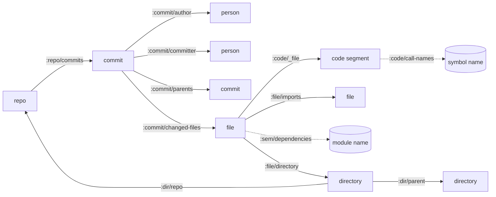

# Noumenon

Noumenon is a Datomic-backed knowledge graph for codebase understanding.

Instead of treating a repository as an opaque pile of files, Noumenon turns it into a living graph of relationships: commits, authors, files, code segments, architecture, and dependencies. It combines deterministic facts with semantic analysis so humans and agents can ask focused questions and get grounded answers fast. For AI agents, this enables surgical retrieval: fetch the exact entities and edges needed for a task instead of stuffing raw files into context windows, which can reduce token spend and avoid prompt bloat.

## Why Noumenon

Long-context prompting alone breaks down as repositories grow. Noumenon takes a different path: model the codebase as structured data you can query, audit, and reason over.

That structure gives agents a precise retrieval strategy: query first, pull only relevant facts, then reason. The result is designed to improve signal per token and lower context-window waste.

It blends three complementary layers:

- Deterministic facts from Git + filesystem structure
- Semantic annotations from model analysis
- Query-first exploration via Datomic + Datalog

That unlocks questions like:

- Which files are complexity hotspots?
- What files tend to co-change?
- Who are the primary contributors in a subsystem?
- What is the likely impact radius of a change?

And more complex questions such as:

- Which `:file/path` entities have both high `:commit/changed-files` frequency and `:sem/complexity` = `:very-complex`?
- For a target `:file/path`, what transitive `:file/imports` edges and reverse importers (`:file/_imports`) define its blast radius?
- Which `:code/file+name` segments are marked `:code/deprecated? true` but live in files with recent `:commit/committed-at` activity?
- Where do `:file/imports` edges cross `:arch/layer` boundaries, and which `:arch/component` pairs are most coupled?
- Which files combine `:code/safety-concerns`, low bus factor (few distinct `:commit/author`), and high fix-heavy history (`:commit/kind :fix`)?

## What you get

- A CLI-first workflow built for real repositories (`clj -M:run ...`)
- A Datomic knowledge graph per imported repo name, with stable identities
- Named EDN queries in `resources/queries/` for repeatable analysis
- Deterministic import graph extraction (`postprocess`) for impact tracing
- AI-powered `ask` mode that reasons by querying, not guessing
- Benchmark flows (`benchmark`, `longbench`) to measure quality and cost

## Requirements

- JDK 21+
- Clojure CLI (`clj`)
- Git
- Provider setup (depends on chosen provider)

### Provider setup

Noumenon supports three provider modes:

| Provider | Mode | What you need |
|---|---|---|
| `glm` (default) | HTTP API | `NOUMENON_ZAI_TOKEN` |
| `claude-api` | HTTP API | `ANTHROPIC_API_KEY` |
| `claude-cli` (alias: `claude`) | Local CLI | `claude` installed and authenticated |

Use `.env.example` as a template for local environment setup.

## Installation

### Option 1: Run from source (recommended)

```bash
git clone https://github.com/leifericf/noumenon.git
cd noumenon
clj -M:run --help
```

### Option 2: Standalone JAR

Download the latest JAR from [GitHub Releases](https://github.com/leifericf/noumenon/releases):

```bash
java -jar noumenon-0.1.0.jar --help
```

Build from source if needed:

```bash
clj -T:build uber
java -jar target/noumenon-0.1.0.jar --version
```

### Option 3: Use as a Clojure dependency

```clojure
{:aliases
 {:noumenon
  {:extra-deps {io.github.leifericf/noumenon {:git/tag "v0.1.0" :git/sha "d97bdac"}}
   :main-opts ["-m" "noumenon.main"]}}}
```

Then run:

```bash
clj -M:noumenon --help
```

## Quick Start

Use a local Git repo path or a Git URL.

### 1) Import deterministic facts

```bash
clj -M:run import /path/to/repo
# or:
clj -M:run import https://github.com/ring-clojure/ring.git
```

### 2) Run semantic analysis

```bash
clj -M:run analyze /path/to/repo --provider glm --model sonnet
```

During `analyze`, Noumenon prints token and cost telemetry to stderr:

- Pre-run estimate (input/output tokens, estimated cost, ETA)
- Per-file usage (`tokens=input/output`)
- Final aggregate usage (total input/output tokens, total cost, elapsed time)

Notes:

- Cost estimation is model-aware for priced Anthropic model IDs.
- For providers/models without pricing metadata (for example `glm`), token counts are still tracked but USD cost may be `0.0`.

### 3) (Optional) Build deterministic import graph

```bash
clj -M:run postprocess /path/to/repo
```

### Keep the graph in sync

As the codebase changes, sync the knowledge graph with the latest git state:

```bash
clj -M:run sync /path/to/repo                   # fast: import + postprocess only
clj -M:run sync /path/to/repo --analyze          # also re-analyze changed files (LLM)
clj -M:run watch /path/to/repo --interval 30     # auto-sync every 30s on new commits
```

`sync` works as a first-time setup too — if no database exists, it runs the full import pipeline. On subsequent runs it detects changes via git HEAD SHA and incrementally updates only what changed.

The MCP server also auto-syncs before queries when HEAD changes (disable with `--no-auto-sync`).

### 4) Inspect status, databases, and queries

```bash
clj -M:run status /path/to/repo
clj -M:run list-databases
clj -M:run show-schema /path/to/repo
clj -M:run query list
clj -M:run query files-by-complexity /path/to/repo
```

### 5) Ask the graph a natural-language question

```bash
clj -M:run ask -q "Which files are the biggest risk hotspots?" /path/to/repo
```

## Pipeline Overview


`postprocess` is optional but recommended when you want deterministic dependency and test-impact analysis. `sync` can replace the manual `import` + `postprocess` workflow and handles incremental updates.

## Command Reference

```bash
clj -M:run <command> [options]
```

Run `clj -M:run --help` for global help, or `clj -M:run <command> --help` for details.

`import` accepts either `<repo-path>` or a Git URL (auto-cloned to `data/repos/<name>/`). See [Using with Perforce](#using-with-perforce) for Helix Core repositories.

### Unified CLI and MCP interface

The CLI and MCP server expose the same capabilities. MCP tools inherit `--db-dir`, `--provider`, and `--model` from the `serve` command flags. `noumenon_ask` and `noumenon_analyze` also accept `provider` and `model` per-call to override server defaults.

| Command | CLI | MCP tool | Description |
|---|---|---|---|
| Import | `import <path>` | `noumenon_import` | Import git history and file structure |
| Analyze | `analyze <path>` | `noumenon_analyze` | Enrich files with LLM semantic metadata |
| Postprocess | `postprocess <path>` | `noumenon_postprocess` | Extract cross-file import graph (no LLM) |
| Sync | `sync <path>` | `noumenon_sync` | Sync knowledge graph with latest git state |
| Ask | `ask -q <question> <path>` | `noumenon_ask` | Ask a question using iterative Datalog querying |
| Query | `query <name> <path>` | `noumenon_query` | Run a named Datalog query |
| List queries | `query list` | `noumenon_list_queries` | List available named queries |
| Show schema | `show-schema <path>` | `noumenon_get_schema` | Show database schema with all attributes |
| Status | `status <path>` | `noumenon_status` | Show entity counts for a repository |
| List databases | `list-databases` | `noumenon_list_databases` | List all databases with stats |
| Watch | `watch <path>` | -- | Auto-sync on new commits (CLI-only) |
| Serve | `serve` | -- | Start MCP server (CLI-only) |
| Benchmark | `benchmark <path>` | -- | Evaluate knowledge graph efficacy (CLI-only) |
| LongBench | `longbench <sub>` | -- | LongBench v2 experiments (CLI-only) |

### CLI options by command

**`import`** `<repo-path-or-url>`
- `--db-dir` — storage directory (default: `data/datomic/`)

**`analyze`** `<repo-path>`
- `--model` — model alias (default: provider default)
- `--provider` — `glm` (default), `claude-api`, `claude-cli`
- `--max-files` — stop after analyzing N files (useful for sampling)
- `--concurrency` — parallel workers, 1-20 (default: 3)
- `--min-delay` — min ms between LLM requests (default: 0)
- `--db-dir` — storage directory (default: `data/datomic/`)
- `-v` / `--verbose` — verbose stderr logs

**`postprocess`** `<repo-path>`
- `--concurrency` — parallel workers, 1-20 (default: 8)
- `--db-dir` — storage directory (default: `data/datomic/`)

**`sync`** `<repo-path>`
- `--analyze` — also run LLM analysis on changed files
- `--model` — model alias (default: provider default)
- `--provider` — `glm` (default), `claude-api`, `claude-cli`
- `--concurrency` — parallel workers, 1-20 (default: 8)
- `--db-dir` — storage directory (default: `data/datomic/`)

**`ask`** `-q <question> <repo-path>`
- `-q` / `--question` — question to ask (required)
- `--model` — model alias (default: provider default)
- `--provider` — `glm` (default), `claude-api`, `claude-cli`
- `--max-iterations` — max query iterations (default: 10)
- `--db-dir` — storage directory (default: `data/datomic/`)
- `-v` / `--verbose` — verbose stderr logs

**`query`** `<query-name> <repo-path>` or `query list`
- `--param` — supply input as `key=value` (repeatable)
- `--db-dir` — storage directory (default: `data/datomic/`)

**`show-schema`** `<repo-path>`
- `--db-dir` — storage directory (default: `data/datomic/`)

**`status`** `<repo-path>`
- `--db-dir` — storage directory (default: `data/datomic/`)

**`list-databases`**
- `--delete` — delete a database by name
- `--db-dir` — storage directory (default: `data/datomic/`)

**`watch`** `<repo-path>`
- `--interval` — polling interval in seconds (default: 30)
- `--analyze` — also run LLM analysis on changed files
- `--model` — model alias (default: provider default)
- `--provider` — `glm` (default), `claude-api`, `claude-cli`
- `--concurrency` — parallel workers, 1-20 (default: 8)
- `--db-dir` — storage directory (default: `data/datomic/`)

**`serve`**
- `--provider` — default LLM provider (default: `glm`)
- `--model` — default model alias
- `--no-auto-sync` — disable automatic sync before queries
- `--db-dir` — storage directory (default: `data/datomic/`)

**`benchmark`** `<repo-path>`
- `--model` — model alias (default: provider default)
- `--judge-model` — model alias for judge stages
- `--provider` — `glm` (default), `claude-api`, `claude-cli`
- `--concurrency` — parallel workers, 1-20 (default: 3)
- `--min-delay` — min ms between LLM requests (default: 0)
- `--max-cost` — stop when cost exceeds threshold in USD
- `--max-questions` — stop after n questions
- `--stop-after` — stop after n seconds
- `--resume` — resume from checkpoint (default: latest)
- `--skip-raw` — omit raw-context condition
- `--skip-judge` — skip LLM judge stages
- `--fast` — deterministic + query-only (cheapest)
- `--full` — all questions including LLM-judged
- `--canary` — run q01+q02 first as canary
- `--db-dir` — storage directory (default: `data/datomic/`)

**`longbench`** `<download|experiment>`
- `--config` — path to experiment config EDN file (experiment only)

Universal flags: `-h` / `--help`, `--version`

## Named Queries

Named queries live in `resources/queries/` (EDN). Use:

```bash
clj -M:run query list
```

Common examples:

- `hotspots`
- `bug-hotspots`
- `top-contributors`
- `co-changed-files`
- `files-by-complexity`
- `files-by-layer`
- `component-dependencies`
- `dependency-hotspots`
- `pure-segments`
- `file-history` (parameterized)
- `llm-cost-total`
- `llm-cost-by-model`
- `llm-cost-by-file`

## Data Model

Noumenon combines four sources:

1. Git history (deterministic)
2. File structure (deterministic)
3. Semantic analysis (LLM)
4. Import graph extraction (`postprocess`, deterministic)

### Entity Types

| Entity | Identity | Key attributes |
|---|---|---|
| `repo` | `:repo/uri` | `:repo/commits`, `:repo/head-sha` |
| `commit` | `:git/sha` (`:git/type :commit`) | `:commit/message`, `:commit/kind`, `:commit/authored-at`, `:commit/committed-at`, `:commit/additions`, `:commit/deletions` |
| `person` | `:person/email` | `:person/name` |
| `file` | `:file/path` | `:file/ext`, `:file/lang`, `:file/lines`, `:file/size`, `:file/imports`, `:sem/*` |
| `directory` | `:dir/path` | `:dir/parent`, `:dir/repo` |
| `code segment` | `:code/file+name` (tuple of `:code/file` + `:code/name`) | `:code/kind`, `:code/line-start`, `:code/line-end`, `:code/args`, `:code/returns`, `:code/visibility`, `:code/complexity`, `:code/smells`, `:code/call-names`, `:code/pure?`, `:code/ai-likelihood` |
| `tx metadata` | tx entity | `:tx/op`, `:tx/source`, `:tx/analyzer`, `:tx/model`, `:tx/input-tokens`, `:tx/output-tokens`, `:tx/cost-usd` |
| `provenance` | mixed (entity + tx metadata) | `:prov/confidence` on analyzed entities; `:prov/model-version`, `:prov/prompt-hash`, `:prov/analyzed-at` on analysis transactions |
| `component` (schema-defined) | `:component/name` | `:component/depends-on`, `:component/files` |

### Relationship Graph



`chunk` entities (`:chunk/parent`, `:chunk/index`, `:chunk/text`) are used for long text values that exceed Datomic string limits.

Component relationships (`:arch/component`, `:component/files`, `:component/depends-on`) and resolved segment call edges (`:code/calls`) are schema-supported and queryable when present, but are not populated by the default `import -> analyze -> postprocess` pipeline today.

## Language Support

Import + LLM analysis works with any language. `postprocess` adds deterministic import extraction with tiered support:

| Tier | Languages | Method | External tool |
|---|---|---|---|
| Full | Clojure | `tools.namespace` parsing + test mapping | none |
| Import extraction | Elixir | AST parser via `Code.string_to_quoted` | `elixir` |
| Import extraction | Python | `ast` parser | `python3` |
| Import extraction | JavaScript / TypeScript | Regex-based import extraction via Node runtime | `node` |
| Import extraction | C / C++ | compiler dependency output | `clang` or `gcc` |
| Import extraction | Go | toolchain metadata | `go` |
| Import extraction | Rust | `mod` detection | none (regex) |
| Import extraction | Java | `import` detection | none (regex) |
| Import extraction | Erlang | `-include` / `-include_lib` detection | none (regex) |
| Analysis only | many others | LLM-only semantics | n/a |

Markdown files (`.md`) are imported as file entities but not analyzed — they are prose, not code or config.

### Sensitive File Protection

Noumenon automatically excludes files matching known sensitive patterns from LLM analysis and import extraction. File contents for these paths are **never read or sent to any AI provider**:

| Pattern | Examples |
|---|---|
| Environment files | `.env`, `.env.local`, `.env.production` (not `.env.example`) |
| Crypto keys | `*.pem`, `*.key`, `*.p12`, `*.pfx`, `*.keystore`, `*.jks`, `*.cert` |
| Credential files | `credentials.json`, `token.json`, `.npmrc`, `.pypirc`, `.netrc`, `.htpasswd`, `.pgpass` |
| SSH material | `.ssh/*`, `id_rsa*`, `id_ed25519*`, `id_ecdsa*` |

These files are still recorded in the knowledge graph as file entities (path, size, extension) but their contents are never accessed.

**Your responsibility:** This blocklist covers well-known secret *files*. If you embed secrets directly in source code (hardcoded API keys, tokens, passwords), Noumenon will not detect them — that content will be sent to the LLM like any other code. Use `.gitignore`, pre-commit hooks, or tools like [git-secrets](https://github.com/awslabs/git-secrets) or [gitleaks](https://github.com/gitleaks/gitleaks) to prevent secrets from entering your repository.

## MCP Server

Run Noumenon as an MCP server so agents can call it as a tool:

```bash
clj -M:run serve
# or java -jar noumenon-0.1.0.jar serve
```

### Claude Desktop config

Add to `~/Library/Application Support/Claude/claude_desktop_config.json`:

```json
{
  "mcpServers": {
    "noumenon": {
      "command": "java",
      "args": ["-jar", "/path/to/noumenon-0.1.0.jar", "serve"]
    }
  }
}
```

### Claude Code note

For Claude Code, MCP enablement is usually just:

- Start Noumenon in `serve` mode
- Add/configure the MCP server entry in Claude Code

You do not need extra skills, custom sub-agents, or special `CLAUDE.md` wiring just to make Noumenon discoverable. Those are optional only if you want stricter usage behavior.

### Exposed MCP tools

| Tool | Required params | Optional params | Description |
|---|---|---|---|
| `noumenon_import` | `repo_path` | | Import git history and files |
| `noumenon_analyze` | `repo_path` | `provider`, `model`, `concurrency` (default: 3), `max_files` | Run LLM semantic analysis |
| `noumenon_postprocess` | `repo_path` | `concurrency` (default: 8) | Extract import graph (no LLM) |
| `noumenon_sync` | `repo_path` | `analyze` (default: false) | Sync with latest git state |
| `noumenon_ask` | `repo_path`, `question` | `provider`, `model`, `max_iterations` (default: 10) | Ask a question via iterative querying |
| `noumenon_query` | `repo_path`, `query_name` | `params` | Run a named Datalog query |
| `noumenon_list_queries` | | | List available named queries |
| `noumenon_get_schema` | `repo_path` | | Show database schema |
| `noumenon_status` | `repo_path` | | Get entity counts |
| `noumenon_list_databases` | | | List all databases with stats |

## Benchmarks

Run the benchmark on your own repo to measure whether the knowledge graph meaningfully improves LLM answers about your codebase. Each question is answered twice: once with structured Datomic query results (the knowledge graph) and once with raw source code. If the knowledge-graph-augmented answers score higher, the graph is earning its keep.

Results vary depending on repo size, history depth, and codebase characteristics. Small repos with few commits won't produce meaningful signal.

### Scoring tiers

- **Deterministic (22 questions)** — Primary metric. Answers are compared against Datomic query results using exact matching. Objective and reproducible. Run by default.
- **LLM-judged (18 questions)** — Supplementary metric. A judge LLM scores architectural reasoning answers against rubrics. Useful but subjective. Opt-in via `--full`.

### Progressive testing

By default, only deterministic questions run. Start here — if the deterministic score is poor, there's no point spending tokens on LLM-judged questions. Once you're satisfied with deterministic results, run `--full` to include the architectural reasoning tier.

### Running

```bash
# Default: deterministic questions only (22 questions, both conditions)
clj -M:run benchmark /path/to/repo

# All 40 questions including LLM-judged architectural reasoning
clj -M:run benchmark --full /path/to/repo

# Cheapest mode: deterministic + query-only (no raw context comparison)
clj -M:run benchmark --fast /path/to/repo

# Budget-limited
clj -M:run benchmark --max-cost 2.0 /path/to/repo

# Resume an interrupted run
clj -M:run benchmark --resume /path/to/repo
```

### LongBench v2

Separate from the project benchmark, `longbench` runs LongBench v2 code-repository tasks:

```bash
clj -M:run longbench download
clj -M:run longbench experiment --config path/to/experiment.edn
```

## Cost Planning (Rough)

These are planning estimates, not guarantees. Actual usage depends on file sizes, retries, model choice, provider billing, and whether you run partial workflows.

### Analysis estimate examples

`analyze` uses a built-in planning heuristic of roughly `~1250` input + `~217` output tokens per file.

| Example repo size | Approx source files | Estimated input tokens | Estimated output tokens | Sonnet API rough cost* |
|---|---:|---:|---:|---:|
| Small library (Ring-scale) | 30 | 37,500 | 6,510 | ~$0.21 |
| Medium repo | 500 | 625,000 | 108,500 | ~$3.50 |
| Large service/monorepo slice | 3,000 | 3,750,000 | 651,000 | ~$21.02 |
| Very large repo | 10,000 | 12,500,000 | 2,170,000 | ~$70.05 |

### Benchmark estimate examples

Project benchmark has `40` questions (`22` deterministic, `18` LLM-judged). Default runs deterministic only.

`benchmark` uses a planning heuristic of roughly `~5000` input + `~800` output tokens per LLM call. Deterministic judge stages are free (no LLM call), so effective LLM calls are lower than total stages.

| Benchmark mode | LLM calls | Estimated input tokens | Estimated output tokens | Sonnet API rough cost* |
|---|---:|---:|---:|---:|
| Default (deterministic, both conditions) | 44 (22 × 2 answer stages) | 220,000 | 35,200 | ~$1.19 |
| Full (`--full`, all 40 questions) | 124 (80 answer + 44 LLM judge) | 620,000 | 99,200 | ~$3.35 |
| Fast (`--fast`, deterministic + query-only) | 22 (22 × 1 answer stage) | 110,000 | 17,600 | ~$0.60 |
| LongBench (`longbench run`) | depends on selected question count | scales linearly with questions | scales linearly with questions | model/provider dependent |

\* Cost examples use Anthropic Sonnet pricing assumptions (`$3/M` input tokens, `$15/M` output tokens). Providers without public per-token pricing metadata (for example `glm`) still report token usage, but USD estimates may be `0.0`.

## Development

```bash
clj -M:lint
clj -M:fmt check
clj -M:test
clj -T:build uber
clj -M:nrepl
```

## Project Layout

- `src/noumenon/` - application namespaces
- `resources/schema/` - Datomic schema (EDN)
- `resources/queries/` - named Datalog queries and rules
- `resources/prompts/` - prompt templates
- `test/` - test suite
- `data/` - local runtime artifacts (ignored)

## Using with Perforce

Noumenon works with Perforce (Helix Core) repositories via [git-p4](https://git-scm.com/docs/git-p4), which creates a local Git mirror from a P4 depot path. Noumenon then treats it as a regular Git repo.

**Requirements**: `git`, `p4` CLI, and `git-p4` (bundled with most Git distributions) must be on PATH. Your Perforce environment (`P4PORT`, `P4USER`, `P4CLIENT`) must be configured.

### Import a Perforce depot

```bash
git p4 clone //depot/project/main/... data/repos/project
clj -M:run import data/repos/project
```

### Sync with new changelists

```bash
cd data/repos/project && git p4 sync && git p4 rebase && cd -
clj -M:run sync data/repos/project
```

`git p4 sync` fetches new changelists from the Perforce server and `git p4 rebase` applies them as Git commits. Then `noumenon sync` detects the new HEAD and incrementally updates the knowledge graph.

### If your server has Helix4Git

If your Perforce admin has configured [Helix4Git](https://www.perforce.com/products/helix-core-git-connector), the depot is already mirrored as a Git repo. Point Noumenon at the Git URL directly — no `git-p4` needed.

See the [git-p4 documentation](https://git-scm.com/docs/git-p4) for full usage details, including filtering by depot path, handling streams, and troubleshooting.

## Status

This project is under active development and currently optimized for CLI workflows.

## License

MIT. See `LICENSE`.
