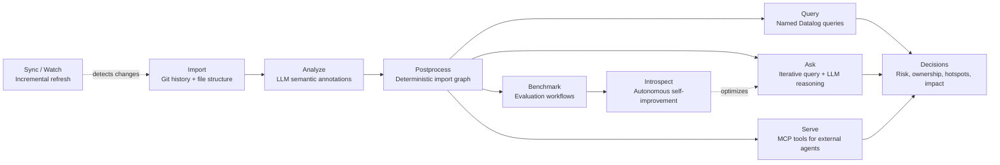

# Noumenon

[Datomic](https://www.datomic.com)-backed knowledge graph for codebase understanding. See [noumenon.leifericf.com](https://noumenon.leifericf.com) for an overview.

## Requirements

- [JDK 21+](https://adoptium.net)
- [Clojure CLI](https://clojure.org/guides/install_clojure) (`clj`)
- [Git](https://git-scm.com)
- Provider setup (depends on chosen provider)

### Provider setup

Noumenon supports three provider modes:

| Provider | Mode | What you need |
|---|---|---|
| `glm` (default) | HTTP API | `NOUMENON_ZAI_TOKEN` |
| `claude-api` | HTTP API | [`ANTHROPIC_API_KEY`](https://console.anthropic.com/settings/keys) |
| `claude-cli` (alias: `claude`) | Local CLI | [Claude Code](https://claude.ai/claude-code) installed and authenticated |

Use `.env.example` as a template for local environment setup.

## Installation

### Option 1: Run from source (recommended)

```bash
git clone https://github.com/leifericf/noumenon.git
cd noumenon
clj -M:run --help
```

### Option 2: Standalone JAR

Download the latest JAR from [GitHub Releases](https://github.com/leifericf/noumenon/releases):

```bash
java -jar noumenon-0.2.1.jar --help
```

Build from source if needed:

```bash
clj -T:build uber
java -jar target/noumenon-0.2.1.jar --version
```

### Option 3: Use as a Clojure dependency

```clojure
{:aliases
 {:noumenon
  {:extra-deps {io.github.leifericf/noumenon {:git/tag "v0.2.1" :git/sha "2782dd1"}}
   :main-opts ["-m" "noumenon.main"]}}}
```

Then run:

```bash
clj -M:noumenon --help
```

## Quick Start

Use a local Git repo path or a Git URL.

### 1) Import deterministic facts

```bash
clj -M:run import /path/to/repo
# or:
clj -M:run import https://github.com/ring-clojure/ring.git
```

### 2) Run semantic analysis

```bash
clj -M:run analyze /path/to/repo --provider glm --model sonnet
```

### 3) (Optional) Build deterministic import graph

```bash
clj -M:run enrich /path/to/repo
```

### Keep the graph in sync

As the codebase changes, update the knowledge graph with the latest git state:

```bash
clj -M:run update /path/to/repo
clj -M:run watch /path/to/repo
```

`update` also works for first-time setup — it runs the full import if no database exists. On subsequent runs it detects HEAD changes and incrementally updates. The MCP server auto-syncs before queries.

### 4) Inspect status, databases, and queries

```bash
clj -M:run status /path/to/repo
clj -M:run list-databases
clj -M:run show-schema /path/to/repo
clj -M:run query list
clj -M:run query files-by-complexity /path/to/repo
```

### 5) Ask the graph a natural-language question

```bash
clj -M:run ask -q "Which files are the biggest risk hotspots?" /path/to/repo
```

## Pipeline Overview



`enrich` is optional but recommended for deterministic dependency and test-impact analysis. `update` replaces the manual `import` + `enrich` workflow. `introspect` uses benchmark results to autonomously improve the ask agent's prompts, examples, rules, and code.

## Command Reference

```bash
clj -M:run <command> [options]
clj -M:run <command> --help
```

The CLI and [MCP](https://modelcontextprotocol.io) server expose the same capabilities. Use `--help` on any subcommand for details.

| Command | CLI | MCP tool | Description |
|---|---|---|---|
| Import | `import <path>` | `noumenon_import` | Import git history and file structure |
| Analyze | `analyze <path>` | `noumenon_analyze` | Enrich files with LLM semantic metadata (`--reanalyze` for re-analysis) |
| Enrich | `enrich <path>` | `noumenon_enrich` | Extract cross-file import graph (no LLM) |
| Update | `update <path>` | `noumenon_update` | Sync knowledge graph with latest git state |
| Digest | `digest <path>` | `noumenon_digest` | Run full pipeline: import, enrich, analyze, benchmark |
| Ask | `ask -q <question> <path>` | `noumenon_ask` | Ask a question using iterative Datalog querying |
| Query | `query <name> <path>` | `noumenon_query` | Run a named Datalog query |
| List queries | `query list` | `noumenon_list_queries` | List available named queries |
| Show schema | `show-schema <path>` | `noumenon_get_schema` | Show database schema with all attributes |
| Status | `status <path>` | `noumenon_status` | Show entity counts for a repository |
| List databases | `list-databases` | `noumenon_list_databases` | List all databases with stats |
| Benchmark | `benchmark <path>` | `noumenon_benchmark_run` | Evaluate knowledge graph efficacy |
| Benchmark results | -- | `noumenon_benchmark_results` | Get benchmark results (latest or by ID) |
| Benchmark compare | -- | `noumenon_benchmark_compare` | Compare two benchmark runs by score differences |
| Introspect | `introspect <path>` | `noumenon_introspect` (blocking) / `noumenon_introspect_start` (async) | Autonomous self-improvement loop |
| Introspect status | -- | `noumenon_introspect_status` | Check running introspect session |
| Introspect history | -- | `noumenon_introspect_history` | Query introspect runs and iterations |
| Reseed | `reseed` | `noumenon_reseed` | Reload prompts, queries, and rules into meta database |
| Artifact history | `artifact-history --type <type>` | `noumenon_artifact_history` | Show change history for a prompt or rules artifact |
| Watch | `watch <path>` | -- | Auto-sync on new commits (CLI-only) |
| Serve | `serve` | -- | Start MCP server (CLI-only) |

## Named Queries

56 named Datalog queries live in `resources/queries/` (EDN), covering hotspots, ownership, dependencies, complexity, churn, impact analysis, issue tracking, LLM cost tracking, benchmarks, and introspect history. Run `clj -M:run query list` to see them all.

## Data Model

Noumenon combines four sources:

1. Git history (deterministic)
2. File structure (deterministic)
3. Semantic analysis (LLM)
4. Import graph extraction (`enrich`, deterministic)

### Entity Types

| Entity | Identity | Key attributes |
|---|---|---|
| `repo` | `:repo/uri` | `:repo/commits`, `:repo/head-sha` |
| `commit` | `:git/sha` (`:git/type :commit`) | `:commit/message`, `:commit/kind`, `:commit/issue-refs`, `:commit/authored-at`, `:commit/committed-at`, `:commit/additions`, `:commit/deletions` |
| `person` | `:person/email` | `:person/name` |
| `file` | `:file/path` | `:file/ext`, `:file/lang`, `:file/lines`, `:file/size`, `:file/imports`, `:sem/*` |
| `directory` | `:dir/path` | `:dir/parent`, `:dir/repo` |
| `code segment` | `:code/file+name` (tuple of `:code/file` + `:code/name`) | `:code/kind`, `:code/line-start`, `:code/line-end`, `:code/args`, `:code/returns`, `:code/visibility`, `:code/complexity`, `:code/smells`, `:code/call-names`, `:code/pure?`, `:code/ai-likelihood` |
| `tx metadata` | tx entity | `:tx/op`, `:tx/source`, `:tx/analyzer`, `:tx/model`, `:tx/input-tokens`, `:tx/output-tokens`, `:tx/cost-usd` |
| `provenance` | mixed (entity + tx metadata) | `:prov/confidence` on analyzed entities; `:prov/model-version`, `:prov/prompt-hash`, `:prov/analyzed-at` on analysis transactions |
| `component` (schema-defined) | `:component/name` | `:component/depends-on`, `:component/files` |

### Relationship Graph

```mermaid
flowchart LR
  Repo[repo] -->|:repo/commits| Commit[commit]
  Commit -->|:commit/author| Author[person]
  Commit -->|:commit/committer| Committer[person]
  Commit -->|:commit/parents| Parent[commit]
  Commit -->|:commit/changed-files| File[file]
  Commit -.->|:commit/issue-refs| IssueRef[("#123 / PROJ-456 / URL")]

  File -->|:file/directory| Dir[directory]
  Dir -->|:dir/parent| ParentDir[directory]
  Dir -->|:dir/repo| Repo

  File -->|:file/imports| ImportedFile[file]
  File -.->|:sem/dependencies| DependencyName[(module name)]

  File -->|:code/_file| Code[code segment]
  Code -.->|:code/call-names| CalledName[(symbol name)]
```



`chunk` entities (`:chunk/parent`, `:chunk/index`, `:chunk/text`) handle long text values exceeding Datomic string limits. Component relationships (`:arch/component`, `:component/depends-on`) and resolved call edges (`:code/calls`) are schema-supported but not yet populated by the default pipeline.

## Language Support

Import and LLM analysis work with any language. `enrich` adds deterministic import extraction:

| Tier | Languages | Method | External tool |
|---|---|---|---|
| Full | Clojure | `tools.namespace` parsing + test mapping | none |
| Import extraction | Elixir | AST parser via `Code.string_to_quoted` | `elixir` |
| Import extraction | Python | `ast` parser | `python3` |
| Import extraction | JavaScript / TypeScript | Regex-based import extraction via Node runtime | `node` |
| Import extraction | C / C++ | compiler dependency output | `clang` or `gcc` |
| Import extraction | C# | `using` directive detection | none (regex) |
| Import extraction | Rust | `mod` detection | none (regex) |
| Import extraction | Java | `import` detection | none (regex) |
| Import extraction | Erlang | `-include` / `-include_lib` detection | none (regex) |
| Analysis only | many others | LLM-only semantics | n/a |

Markdown files are imported as entities but not analyzed.

### Sensitive File Protection

Files matching known sensitive patterns are **never read or sent to any AI provider**:

| Pattern | Examples |
|---|---|
| Environment files | `.env`, `.env.local`, `.env.production` (not `.env.example`) |
| Crypto keys | `*.pem`, `*.key`, `*.p12`, `*.pfx`, `*.keystore`, `*.jks`, `*.cert` |
| Credential files | `credentials.json`, `token.json`, `.npmrc`, `.pypirc`, `.netrc`, `.htpasswd`, `.pgpass` |
| SSH material | `.ssh/*`, `id_rsa*`, `id_ed25519*`, `id_ecdsa*` |

These files are still tracked as entities (path, size, extension) but their contents are never accessed.

**Note:** This covers well-known secret *files*. Secrets hardcoded in source code will still be sent to the LLM. Use [git-secrets](https://github.com/awslabs/git-secrets) or [gitleaks](https://github.com/gitleaks/gitleaks) to prevent secrets from entering your repo.

## MCP Server

Run Noumenon as an [MCP](https://modelcontextprotocol.io) server so agents can call it as a tool:

```bash
clj -M:run serve
# or java -jar noumenon-0.2.1.jar serve
```

### [Claude Desktop](https://claude.ai/download) config

Add to `~/Library/Application Support/Claude/claude_desktop_config.json`:

```json
{
  "mcpServers": {
    "noumenon": {
      "command": "java",
      "args": ["-jar", "/path/to/noumenon-0.2.1.jar", "serve"]
    }
  }
}
```

### [Claude Code](https://claude.ai/claude-code) config

Add to `~/.claude/settings.json` (global) or `.mcp.json` (per-project):

```json
{
  "mcpServers": {
    "noumenon": {
      "command": "bash",
      "args": ["-c", "source .env && exec clj -M:run serve"],
      "cwd": "/path/to/noumenon"
    }
  }
}
```

The `source .env` loads provider tokens. If you don't need env vars, simplify to `"command": "clj"` with `"args": ["-M:run", "serve"]`.

## Benchmarks

Run the benchmark on your own repo to measure whether the knowledge graph improves LLM answers about your codebase. See [reports/digest-run-2026-03-27.md](reports/digest-run-2026-03-27.md) for results from a full run across 9 repos and 8 languages.

## Cost Estimates

`analyze` averages roughly `~4,500` input + `~750` output tokens per file. Example projections using [Anthropic Sonnet pricing](https://docs.anthropic.com/en/docs/about-claude/models) (`$3/M` input, `$15/M` output):

| Repo size | Source files | Estimated cost |
|---|---:|---:|
| Small (Ring-scale) | 90 | ~$2 |
| Medium | 500 | ~$12 |
| Large (Redis-scale) | 1,350 | ~$34 |
| Very large (Guava-scale) | 3,300 | ~$82 |

`benchmark` costs ~$0.25-$1.30 per run depending on mode. Providers without per-token pricing (e.g. `glm`) still track token counts but report `$0.00`.

## Development

```bash
clj -M:lint
clj -M:fmt check
clj -M:test
clj -T:build uber
clj -M:nrepl
```

## Project Layout

- `src/noumenon/` - application namespaces
- `resources/schema/` - Datomic schema (EDN)
- `resources/queries/` - named Datalog queries and rules
- `resources/prompts/` - prompt templates
- `test/` - test suite
- `data/` - local runtime artifacts (ignored)

## Using with Perforce

Works with Helix Core via [git-p4](https://git-scm.com/docs/git-p4), which creates a local Git mirror from a P4 depot path.

**Requirements**: `git`, `p4`, and `git-p4` on PATH. Perforce environment (`P4PORT`, `P4USER`, `P4CLIENT`) configured.

### Import a Perforce depot

```bash
git p4 clone //depot/project/main/... data/repos/project
clj -M:run import data/repos/project
```

### Sync with new changelists

```bash
cd data/repos/project && git p4 sync && git p4 rebase && cd -
clj -M:run update data/repos/project
```

If your server has [Helix4Git](https://www.perforce.com/products/helix-core-git-connector), point Noumenon at the Git URL directly — no `git-p4` needed.

## Status

This project is under active development and currently optimized for CLI workflows.

This project was developed using [leifericf's Claude Code Toolkit](https://github.com/leifericf/claude-code-toolkit).

## License

MIT. See `LICENSE`.
