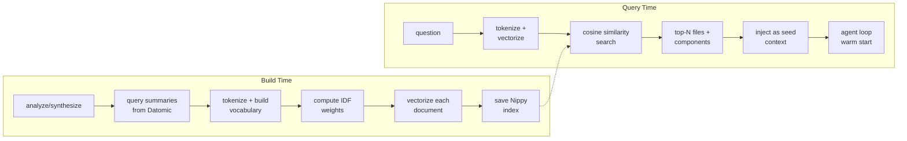

# Noumenon `embed`: TF-IDF Vector Search for Semantic Discovery

**Date:** 2026-04-03
**Operator:** Claude Opus 4.6 (automated)
**Branch:** `feat/tfidf-vector-seed` (5 commits, ~540 lines added across 15 files)
**Test suite:** 515 tests, 1,737 assertions, 0 failures

---

## 1. The Problem

### 1.1 The ask agent searches blindly

Noumenon's ask agent answers questions by iteratively querying a Datomic knowledge graph via Datalog. It starts with zero knowledge of which files or components are relevant to the question. The LLM must guess which entities to query, often spending 3–5 iterations before finding anything useful. For a 10-iteration budget, that's 30–50% of the budget spent on blind exploration.

### 1.2 The RAG comparison

This work was prompted by a comparison with [RAG](https://en.wikipedia.org/wiki/Retrieval-augmented_generation) (Retrieval-Augmented Generation) systems. RAG uses vector similarity to find relevant documents before the LLM sees them — the retrieval step narrows the search space so the generator doesn't start cold. Noumenon's knowledge graph is architecturally superior to RAG for relationship queries ("what depends on X?"), but inferior for initial discovery ("which files are about authentication?"). The insight: we can have both.

### 1.3 The opportunity

We already have rich text summaries per file (`:sem/summary`, `:sem/purpose`) and per component (`:component/summary`, `:component/purpose`) from the analyze/synthesize pipeline. These summaries are sitting in Datomic, unused for retrieval. Vectorizing them with TF-IDF and searching by cosine similarity gives the agent a warm start — for free, with no LLM calls.

---

## 2. Design Constraints

### 2.1 Pure Clojure, no external dependencies

The system must work entirely offline with no embedding API, no external vector database, and no native libraries. The only new dependency is [Nippy](https://github.com/taoensso/nippy) for binary serialization — pure Clojure, battle-tested, zero native deps.

### 2.2 Additive, never breaking

The vector seed is purely additive. If no index exists, the ask pipeline works exactly as before. Every call site gracefully degrades: `vector-seed` returns nil, `model-hint` returns nil, `get-cached-index` returns nil. No feature flags, no configuration, no opt-in — it just works better when the index is present.

### 2.3 Compose with existing systems

The TF-IDF infrastructure must serve double duty: semantic search for the ask pipeline and richer input representation for the query routing neural network. Building a second vectorization system would be wasteful. One vocabulary, one set of IDF weights, shared by both consumers.

### 2.4 Per-repo, not global

Each repository gets its own vocabulary and index. "Datalog" is a high-signal term for Noumenon but irrelevant for a React project. Global vocabularies would dilute term importance. The index is a derived artifact — regenerated from Datomic data on any machine.

---

## 3. How It Relates to RAG

| Dimension | RAG | Knowledge Graph (before) | Noumenon Hybrid (after) |
|-----------|-----|--------------------------|-------------------------|
| Discovery | Vector similarity (fuzzy) | Blind LLM iteration | TF-IDF seed + graph traversal |
| Relationships | Implicit (proximity) | Explicit (Datalog) | Explicit (Datalog) |
| Pre-processing | Chunk + embed | Import + analyze | Import + analyze + embed |
| Query-time LLM | Always | Always | Search: never; Ask: seeded |
| Storage | Vector DB | Datomic | Datomic + Nippy file |
| Upgrade path | Better embeddings | — | ONNX local or API embeddings |

The key insight: RAG's strength (fuzzy discovery) and the knowledge graph's strength (precise relationships) are complementary. The TF-IDF seed provides RAG-style discovery, then the agent loop provides graph-style precision. Together they give the agent both *scope* (what to look at) and *method* (what queries to try).

---

## 4. Technical Design

### 4.1 Architecture



### 4.2 TF-IDF vectorization

TF-IDF (Term Frequency–Inverse Document Frequency) weights terms by how important they are to a specific document relative to the corpus:

- **TF** (term frequency): how often a term appears in a document, normalized by document length
- **IDF** (inverse document frequency): `log((1 + N) / (1 + df))` — rare terms get higher weight

The smooth IDF variant `(1 + N) / (1 + df)` avoids zero IDF for terms appearing in all documents, which matters for small corpora. A term appearing in every document still contributes some signal.

The vocabulary is capped at 2,000 terms (sorted by frequency). For Noumenon's ~300 analyzed files, this captures virtually all meaningful terms while keeping vector dimensions manageable.

### 4.3 Cosine similarity

Similarity between two TF-IDF vectors is measured by cosine similarity — the cosine of the angle between them. Two documents about the same topic will point in similar directions in the high-dimensional term space.

The implementation uses raw `double-array` primitives with type hints for unboxed arithmetic. For ~300 vectors of dimension ~2,000, brute-force comparison takes sub-millisecond. No approximate nearest neighbor algorithm (HNSW, etc.) is needed.

### 4.4 Nippy persistence

The vector index — vocabulary, IDF weights, and per-document vectors — is serialized to disk as a [Nippy](https://github.com/taoensso/nippy) file. Nippy's binary format is significantly faster and more compact than EDN for float arrays. The index is loaded into memory on first access and cached in an atom for the duration of the process.

Index file location: `<db-dir>/noumenon/<db-name>/tfidf-index.nippy`

### 4.5 The two-tier hint system

The ask pipeline now injects two complementary hints before the first LLM call:

| Hint | Source | Question answered | Example |
|------|--------|-------------------|---------|
| `vector-seed` | TF-IDF index | "Which entities should I look at?" | "agent.clj, llm.clj, ask-engine component" |
| `model-hint` | Neural net | "Which query pattern should I use?" | "Try hotspots (87%), bus-factor (12%)" |

One tells the agent *where* to look, the other tells it *how* to look. Together they give the agent a warm start on both scope and method — which is exactly what a human would do: "I'd check the agent code, probably using the hotspots query."

---

## 5. Neural Net Upgrade

### 5.1 The problem with bag-of-words

The query routing neural network previously used bag-of-words input: each token's integer index was hashed into a fixed-size bucket (64 dimensions), with counts averaged. This loses all term importance — "the" and "synthesize" contribute equally. Every word is just a bucket increment.

### 5.2 TF-IDF as richer input

The model now takes TF-IDF vectors directly as input. The same vocabulary and IDF weights used for semantic search serve as the neural net's input representation. "Synthesize" now has much higher weight than "the" in the input vector, because IDF captures its rarity in the corpus.

### 5.3 Dimension change

- **Before:** `embedding-dim = 64` (arbitrary bucket count)
- **After:** `embedding-dim = vocab size` (e.g. ~2,000, driven by TF-IDF vocabulary)

The W1 weight matrix grows from `128 × 64 = 8,192` to `128 × 2,000 = 256,000` parameters. This is still tiny — the numerical gradient approach handles it without issue. The larger input space gives the model more discriminative features to learn from.

### 5.4 Shared infrastructure

The `embed.clj` namespace provides `tokenize`, `build-vocab`, `compute-idf`, and `tfidf-vec` — used by both the search system and the neural net. This means:

- Training and inference use the same tokenization and vectorization
- The vocabulary is grounded in actual codebase summaries, not arbitrary
- Improvements to the embedding (better stopwords, subword tokenization, real embeddings) benefit both consumers

---

## 6. MCP Search Tool

A new `noumenon_search` MCP tool exposes TF-IDF search directly — semantic file/component search without the full agent loop. Zero LLM calls. Returns results in milliseconds.

```
noumenon_search("authentication middleware", repo_path=".")

1. src/auth/middleware.clj (file) — score: 0.847
   Authentication middleware for Ring request processing
2. src/auth/session.clj (file) — score: 0.723
   Session management and token validation
3. auth-system (component) — score: 0.691
   Authentication and authorization subsystem
```

This is the cheapest way to find relevant files in Noumenon — much faster and cheaper than `noumenon_ask`, which runs a full agent loop with multiple LLM calls.

---

## 7. Session Feedback Logging

Every ask session now logs its TF-IDF seed results to Datomic via `:ask.session/seed-results`. This enables future analysis:

- **Seed hit rate:** How often did the agent actually query the seeded files?
- **Seed relevance:** Did seeded files appear in the final answer?
- **Introspect integration:** The optimizer can analyze seed effectiveness and tune parameters (top-K, score threshold, vocabulary size)

The data is captured from day one, even before the analysis tooling exists. When we're ready to analyze it, the data will already be there.

---

## 8. Scicloj Ecosystem Evaluation

We evaluated several Clojure libraries for this work:

| Library | What it offers | Decision | Reason |
|---------|---------------|----------|--------|
| [fastmath](https://github.com/generateme/fastmath) | Distance functions, clustering, SMILE backend | Not used | Only need cosine similarity — 10 lines of Clojure |
| [simix](https://github.com/tsers/simix) | HNSW nearest-neighbor on JVM | Not used | Requires native C++ compilation; overkill for ~300 vectors |
| [dtype-next](https://github.com/cnuernber/dtype-next) | Efficient array abstractions | Not used | Plain `double-array` with type hints is sufficient |
| [Nippy](https://github.com/taoensso/nippy) | Binary serialization | **Used** | Perfect for float array persistence, pure Clojure, battle-tested |
| [Neanderthal](https://neanderthal.uncomplicate.org/) | GPU linear algebra | Not used | Already a dependency but not needed for this scale |

The decision was driven by the constraint: pure Clojure, no external dependencies beyond Nippy. For ~300 documents, the naive implementations outperform the overhead of library setup.

---

## 9. Known Limitations

### 9.1 TF-IDF is not semantic similarity

TF-IDF measures term overlap, not meaning. "Authentication system" will match "authentication middleware" well, but won't match "login handler" or "session management" unless those terms appear in the summaries. Real embedding models (all-MiniLM, nomic-embed) capture semantic meaning, not just lexical overlap.

### 9.2 Vocabulary is corpus-specific

The vocabulary is built from the analyzed summaries of a single repository. A model pre-trained on one repo's vocabulary won't work well on another. This is fine for search (each repo gets its own index) but limits the portability of trained neural net models.

### 9.3 No cross-language support

TF-IDF over English summaries won't help with codebases analyzed in other languages (if that ever happens). The tokenizer is English-centric.

### 9.4 Rebuild required after re-analysis

If file summaries change (e.g., after `--reanalyze`), the TF-IDF index needs rebuilding. This happens automatically in the `digest` pipeline but not after standalone `analyze` commands. The embed step should be called explicitly.

---

## 10. Future Directions

These synergies were identified during design and documented for future implementation:

1. **Benchmark layer** — Add "embedded" as an evaluation layer alongside raw/enriched/analyzed/synthesized. This would directly measure whether vector seeding improves answer quality.

2. **Hybrid scoring** — Combine TF-IDF similarity with import-graph proximity for reranking. "These files are semantically similar AND import each other" is a stronger signal than either alone.

3. **UI reasoning trace** — Show vector seed results as a "pre-search" step in the ask UI. Adds transparency to the agent's warm start.

4. **Introspect target** — Let the optimizer tune TF-IDF parameters (vocabulary size, stopword list, top-K count, score threshold) and measure the effect on benchmark scores.

5. **Segment-level search** — Add `:code/purpose` entries for function-granularity matching. "Find functions that validate input" without scanning every file.

6. **ONNX local embeddings** — Swap TF-IDF vectors for real embeddings via onnxruntime on JVM. Same index structure, just denser vectors. The search pipeline doesn't change — only the vectorization step.

7. **Cross-repo vocabulary** — Shared base vocabulary (common programming terms) augmented with repo-specific terms. Would improve neural net portability across repos.

---

## Appendix A: Files

### New files

| File | Lines | Purpose |
|------|-------|---------|
| `src/noumenon/embed.clj` | 175 | TF-IDF vectorizer, cosine search, Nippy persistence, index builder |
| `test/noumenon/embed_test.clj` | 126 | 15 tests: tokenizer, vocab, IDF, cosine similarity, top-k, search |

### Modified files

| File | Change |
|------|--------|
| `deps.edn` | Added `com.taoensso/nippy 3.4.2` |
| `src/noumenon/agent.clj` | Added `vector-seed`, `embed-index` flows through `ask` and `model-hint` |
| `src/noumenon/model.clj` | Replaced bag-of-words with TF-IDF input, updated forward/predict/train |
| `src/noumenon/training_data.clj` | Uses `embed/tokenize` and `embed/tfidf-vec` for dataset generation |
| `src/noumenon/introspect.clj` | Overrides `embedding-dim` from dataset vocab size during training |
| `src/noumenon/main.clj` | Added `do-embed` command, wired into digest pipeline, passes `embed-index` to ask |
| `src/noumenon/cli.clj` | Added `embed` command to registry and command order |
| `src/noumenon/http.clj` | Loads cached embed index, passes to ask via `run-ask` |
| `src/noumenon/mcp.clj` | Added `noumenon_search` tool, passes `embed-index` to ask, added `db-dir` to context |
| `src/noumenon/ask_store.clj` | Persists `:seed-results` in ask sessions |
| `resources/schema/ask.edn` | Added `:ask.session/seed-results` attribute |
| `resources/model/config.edn` | Updated architecture description and default `embedding-dim` |
| `test/noumenon/model_test.clj` | Updated tests from integer tokens to `double-array` input vectors |

## Appendix B: Test Suite

15 new tests in `embed_test.clj`, 19 updated tests in `model_test.clj` (515 total, 1,737 assertions):

- **Tokenizer**: basic splitting, stopword removal, code-term preservation (hyphens, underscores)
- **Vocabulary**: frequency-sorted construction, max-size cap, empty corpus handling
- **IDF**: rare terms get higher weight, smooth variant avoids zero IDF
- **TF-IDF vectors**: correct weighting, absent terms get zero, presence of expected terms
- **Cosine similarity**: identical vectors → 1.0, orthogonal → 0.0, zero vector → 0.0, partial overlap
- **Top-k**: correct ranking, correct count, score presence
- **End-to-end**: Clojure docs more similar to each other than to JavaScript doc
- **Search**: ranked results, nil/empty index handling, vector exclusion from results
- **Model**: forward pass with double-array input, train/evaluate with TF-IDF examples
