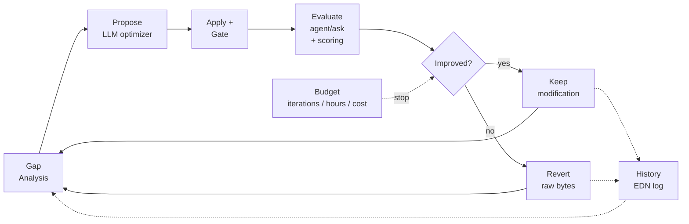

# Noumenon `introspect`: Autonomous Self-Improvement Loop

**Date:** 2026-03-28
**Operator:** Claude Opus 4.6 (automated)
**LLM Provider:** GLM (Z.ai proxy) for all evaluation and optimizer calls
**Branch:** `feat/introspect` (15 commits, 1,539 lines added)
**Test suite:** 463 tests, 1,529 assertions, 0 failures

---

## 1. Inspiration and Vision

### 1.1 The autoresearch pattern

Andrej Karpathy's [autoresearch](https://github.com/karpathy/autoresearch) demonstrates a compelling pattern: give an AI agent a single editable artifact (a GPT training script), a fixed evaluation metric (validation bits-per-byte), and a time-budgeted training step -- then let it run overnight, autonomously proposing and evaluating architecture and hyperparameter changes. Improvements are kept, regressions are discarded via git reset. The agent loops until interrupted.

The key insight is that the "research loop" -- hypothesize, implement, measure, decide -- can be automated when the evaluation function is deterministic and cheap relative to the search.

### 1.2 What if the system being improved is Noumenon itself?

Noumenon already has all the infrastructure this pattern requires:

- **Editable artifacts** -- the agent system prompt, example query selection, Datalog rules, and source code
- **A deterministic evaluation function** -- the benchmark suite scores the ask agent's answers against ground truth
- **An LLM-powered optimizer** -- the same LLM that powers the ask agent can analyze benchmark gaps and propose improvements
- **MCP exposure** -- an external agent can trigger and monitor the loop

The vision: tell Noumenon to improve itself, walk away, and come back to a measurably better system.

### 1.3 Goals

1. **Closed-loop self-improvement** -- no human in the loop during iteration
2. **Self-directed goal discovery** -- the system identifies what to improve, not just how
3. **Multi-target optimization** -- prompts, examples, rules, code, and ML model hyperparameters
4. **Safe rollback** -- modifications that don't improve the benchmark are reverted automatically
5. **Budget controls** -- cap by iterations, wall-clock hours, or cost
6. **MCP-first design** -- usable by both humans (CLI) and AI agents (MCP tool)

---

## 2. How It Differs from autoresearch

### 2.1 Multiple optimization targets vs. single file

Autoresearch edits one file (`train.py`). Noumenon's introspect loop can target five artifact types, and the optimizer LLM chooses which one to modify based on gap analysis:

| Target | Artifact | Risk Level | Gate |
|--------|----------|------------|------|
| `:examples` | `agent-examples.edn` (query selection) | Low | Benchmark |
| `:system-prompt` | `agent-system.edn` (agent instructions) | Medium | Benchmark |
| `:rules` | `rules.edn` (Datalog rules) | Medium | Benchmark |
| `:code` | `src/noumenon/*.clj` (source code) | High | Lint + tests + benchmark |
| `:train` | `model/config.edn` (ML hyperparameters) | Medium | Training + benchmark |

### 2.2 Self-directed goals vs. fixed objective

Autoresearch has one objective: minimize `val_bpb`. The introspect loop performs gap analysis before each iteration -- it examines which benchmark questions scored worst, categorizes failure modes, and asks the optimizer LLM to choose both the target and the goal. The optimizer's response includes a `:goal` field (e.g., "improve temporal query accuracy") that is logged in history and available to subsequent iterations.

### 2.3 Safety gates vs. unconditional evaluation

Autoresearch evaluates every modification (it just trains and measures). Introspect adds pre-evaluation gates for high-risk targets: code modifications must pass the linter and the full test suite before the benchmark runs. Modifications that fail the gate are reverted immediately without wasting an expensive evaluation.

### 2.4 Exact rollback vs. git reset

Autoresearch uses `git reset --hard` to discard failed experiments. Introspect saves the raw file bytes before each modification and restores them exactly on revert, preserving original formatting (comments, whitespace, multi-line strings). This avoids the `pr-str` round-trip problem where Clojure serialization destroys human-readable file formatting.

### 2.5 What this approach does better

- **Broader search space** -- five target types vs. one file
- **Richer signal** -- per-question gap analysis vs. scalar metric
- **Safer** -- lint/test gates, path traversal protection, safe git-add paths
- **Self-aware** -- uses its own knowledge graph (via MCP) to understand itself
- **Composable** -- MCP exposure means an external agent can orchestrate multi-step improvement campaigns

### 2.6 What autoresearch does better

- **Real ML training** -- autoresearch trains an actual neural network with GPU compute and measures wall-clock-normalized performance
- **Lower variance** -- `val_bpb` is deterministic; Noumenon's agent-mode evaluation has LLM non-determinism across runs
- **Simpler** -- one file, one metric, one loop. Noumenon's multi-target design adds complexity

---

## 3. Technical Design

### 3.1 Architecture



### 3.2 Evaluation function

The evaluation runs each of the 22 deterministic benchmark questions through `agent/ask` with a reduced iteration budget (6 iterations per question instead of the default 10). Each answer is scored against ground truth using `deterministic-score` (exact-match, no LLM judge). The primary metric is the mean score across all questions.

This is deliberately different from the standard benchmark, which uses a direct LLM prompt (not the agent loop). The introspect evaluation tests the actual system we're optimizing -- the agent's iterative querying behavior, which is affected by the system prompt, example selection, and rules.

Cost per evaluation: ~130 LLM calls (~22 questions x ~6 iterations each).

### 3.3 The meta-prompt

The optimizer LLM receives a structured prompt containing:

1. The current system prompt template (full text)
2. The current example query selection (list of 19 query names)
3. The full catalog of 48+ available named queries
4. The current Datalog rules
5. Per-question benchmark scores with reasoning
6. Gap analysis (categorized wrong/partial answers with failure reasons)
7. History of all prior iterations (target, goal, rationale, outcome, delta)
8. Descriptions of all five target types with output format specifications

The optimizer proposes exactly one EDN map per iteration with `:target`, `:modification`, `:rationale`, and `:goal` fields.

### 3.4 ML model (Phase 2)

A pure-Clojure feedforward network for query routing:

- **Input**: bag-of-words representation of the question text
- **Architecture**: embedding (64-dim) -> dense (128) -> ReLU -> dense (48) -> softmax
- **Output**: probability distribution over named query patterns
- **Training**: numerical gradient descent with a fixed time budget (like autoresearch's 5-minute limit)
- **Evaluation**: top-1 and top-3 accuracy on the training set

The model config (`resources/model/config.edn`) is the "train.py equivalent" -- the optimizer can propose hyperparameter changes, the model is retrained, and the benchmark evaluates whether the trained model improves agent performance.

Deep Diamond and Neanderthal are included as dependencies for future GPU-accelerated training, but the current implementation is pure Clojure with `double-array` operations.

### 3.5 Code self-modification (Phase 3)

The `:code` target allows the optimizer to propose modifications to Noumenon's own source code. Safety constraints:

- Files must be under `src/noumenon/` and end in `.clj`
- Path traversal (`..\`) is blocked
- The linter must pass before tests run
- The full test suite must pass before benchmark evaluation
- Failure at any gate triggers immediate revert

### 3.6 New files

| File | Lines | Purpose |
|------|-------|---------|
| `src/noumenon/introspect.clj` | 560 | Core loop, gap analysis, proposal validation, artifact I/O, evaluation |
| `src/noumenon/model.clj` | 227 | Neural network: init, forward pass, training, persistence |
| `src/noumenon/training_data.clj` | 100 | Tokenization, vocabulary, dataset generation from benchmark |
| `resources/prompts/introspect.edn` | 80 | Meta-prompt template for the optimizer LLM |
| `resources/model/config.edn` | 17 | Model hyperparameter configuration |
| `test/noumenon/introspect_test.clj` | 272 | 35 tests for parsing, validation, history, gap analysis, security |
| `test/noumenon/model_test.clj` | 138 | 20 tests for model, training, tokenization, round-trips |

### 3.7 Modified files

| File | Change |
|------|--------|
| `src/noumenon/agent.clj` | Added `reset-prompt-cache!` to invalidate delay-cached prompt resources |
| `src/noumenon/cli.clj` | Added `introspect` command spec, parser, and help |
| `src/noumenon/main.clj` | Added `do-introspect` dispatcher with optimizer + evaluator LLM setup |
| `src/noumenon/mcp.clj` | Added `noumenon_introspect` tool definition and handler |
| `deps.edn` | Added `uncomplicate/deep-diamond` and `uncomplicate/neanderthal` |

---

## 4. Bugs Found and Fixed

The implementation went through two thorough testing passes. Nine bugs were found and fixed, each committed separately.

### 4.1 Argument order swap in resolve-question-params (Critical)

**Commit:** `61b099f`
**Symptom:** NPE on startup -- `Cannot invoke "Object.toString()" because "s" is null`
**Root cause:** The `->>` threading macro passed `questions` as the last argument to `bench/resolve-question-params`, but the function signature is `[questions targets]`. The targets map was being iterated as if it were a question sequence.
**Fix:** Replaced `->>` pipeline with a direct function call.

### 4.2 format-history NPE on skipped records (Critical)

**Commit:** `2c0b79d`
**Symptom:** NPE when formatting history containing skipped iterations.
**Root cause:** Skipped records (from parse failures or validation errors) have no `:target` key. `(name nil)` throws NPE.
**Fix:** Default to `"unknown"` for nil `:target` and `:outcome` fields, and `"no rationale"` for nil rationale.

### 4.3 load-history crash on corrupted files (Medium)

**Commit:** `2c0b79d`
**Symptom:** `edn/read-string` throws on malformed EDN in the history file.
**Root cause:** No error handling for corrupted or partially-written history files (e.g., after a crash during `append-history!`).
**Fix:** Wrapped in try/catch, returns `[]` on parse failure. Also validates that the parsed data is a vector.

### 4.4 parse-proposal NPE on nil text (Medium)

**Commit:** `2c0b79d`
**Symptom:** NPE when the LLM returns nil text (timeout, error, empty response).
**Root cause:** `analyze/strip-markdown-fences` does not handle nil input.
**Fix:** Early return `nil` when text is nil.

### 4.5 git add -A stages unsafe files (Security)

**Commit:** `2c0b79d`
**Symptom:** `git add -A` would stage `.env`, `data/`, and other files that should never be committed.
**Root cause:** Convenience shortcut in `git-commit-improvement!` used `-A` (add all) instead of targeting specific safe paths.
**Fix:** Only stages files under `resources/prompts/`, `resources/queries/`, `resources/model/`, and `src/noumenon/`.

### 4.6 model/evaluate division by zero (Medium)

**Commit:** `670615c`
**Symptom:** ArithmeticException when evaluating a model with an empty dataset.
**Root cause:** `(/ (double ...) n)` where `n = 0` when the dataset has no examples.
**Fix:** Early return `{:accuracy 0.0 :top3-accuracy 0.0}` for empty datasets.

### 4.7 cross-entropy-loss ArrayIndexOutOfBounds (Medium)

**Commit:** `670615c`
**Symptom:** Array index out of bounds when a training example has a label index >= the model's output dimension.
**Root cause:** No bounds check on the label index before `(aget probs label)`.
**Fix:** Returns a fixed max penalty (10.0) for out-of-range labels.

### 4.8 Revert destroys file formatting (Low)

**Commit:** `0a77abd`
**Symptom:** After a failed iteration, the reverted file has different formatting -- multi-line strings become single-line, comments are stripped.
**Root cause:** `apply-modification!` saved the parsed Clojure data structure as the rollback value, then `revert-modification!` used `pr-str` to write it back. `pr-str` serializes everything on one line.
**Fix:** Save and restore raw file bytes instead of parsed data.

### 4.9 Path traversal in :code target (Security)

**Commit:** `6423696`
**Symptom:** `src/noumenon/../../etc/passwd.clj` passes both `starts-with?` and `ends-with?` validation.
**Root cause:** The `..` path component was not checked, allowing directory escape.
**Fix:** Added explicit check: reject any path containing `".."`.

### 4.10 CLI error shows wrong help (Low)

**Commit:** `6cf60eb`
**Symptom:** `clj -M:run introspect` (no repo path) shows global help instead of introspect-specific help.
**Root cause:** The introspect parser omitted `:subcommand` from error results, so the error dispatch couldn't find subcommand-specific help.
**Fix:** Always include `:subcommand "introspect"` in parse results, matching the pattern used by other subcommands.

### 4.11 No exception recovery during evaluation (Critical)

**Commit:** `80274ac`
**Symptom:** If `evaluate-agent!` or model training throws after a modification has been applied, the modified file remains on disk with no rollback.
**Root cause:** No try/catch around the apply-evaluate-decide block.
**Fix:** Wrapped the entire block in try/catch. On exception, the modification is reverted, the agent prompt cache is reset, and the iteration is recorded as `:error` in history. The optimizer LLM call is also wrapped -- network errors and rate limits return nil instead of crashing the loop.

---

## 5. Preliminary Test Results

### 5.1 End-to-end runs

Four end-to-end runs were completed during development, exercising all major code paths. All runs targeted the Noumenon repository itself (the project under development) using the GLM provider with Sonnet.

| Run | Baseline | After | Delta | Outcome | Target | Path Exercised |
|-----|----------|-------|-------|---------|--------|----------------|
| 1 | 0.523 | 0.591 | +0.068 | Kept | `:system-prompt` | Improvement accepted |
| 2 | 0.682 | 0.636 | -0.045 | Reverted | `:examples` | Regression reverted |
| 3 | 0.659 | -- | -- | Skipped | -- | LLM parse failure |
| 4 | 0.636 | -- | -- | Skipped | -- | LLM parse failure |

### 5.2 Run 1: Successful improvement (+6.8%)

**Optimizer's gap analysis input** (excerpt from the actual meta-prompt sent to the LLM):

```
Score distribution: 5 correct, 6 partial, 11 wrong

WRONG answers (highest priority):
  q02: Expected layer core not found in answer
  q06: 0/1 components with most transitive deps listed
  q27: 0/3 top most-imported files listed
  q29: 0/3 top circular import groups listed
  q36: 0/1 shared dependency files listed
  q37: 0/3 top cross-directory import pairs listed
  ...
```

**Optimizer's response** (verbatim from the LLM):

> **Goal:** Fix silent failures on empty result sets by requiring explicit negative reporting.
>
> **Rationale:** The benchmark shows frequent failures when queries return empty results (e.g., q02, q06, q27, q29, q36, q37). The current prompt doesn't explicitly instruct the agent to handle zero-result cases, leading to silent omissions or hallucinations. Adding explicit instructions to report empty results as 'No X found' and to handle partial data should directly address 8 wrong answers.

**Target:** `:system-prompt`

**Modification:** Three new instructions appended to the system prompt:

```
13. **CRITICAL: Always verify that your query found data.** If you expect a list of items
    (e.g., "top 3 files") but get zero results, explicitly state "No X found" in your
    answer. Do not omit the information or leave the list blank.
14. **CRITICAL: Handle partial data gracefully.** If you asked for 5 items but only got 3,
    list those 3 accurately. Do not hallucinate missing items or claim the list is complete
    if it isn't.
15. **CRITICAL: Be explicit about negative results.** If a query returns zero results for a
    non-trivial search (e.g., orphan files, circular imports), explicitly say "No X found"
    rather than omitting the answer.
```

**Result:** Mean score improved from **0.523 to 0.591** (+6.8 percentage points). The system kept the modification.

### 5.3 Run 2: Correctly reverted regression (-4.5%)

**Optimizer's response** (verbatim):

> **Goal:** Provide direct query patterns for dependency analysis and contributor metrics to fix wrong/partial answers on import lookups, shared dependencies, and author rankings.
>
> **Rationale:** The current selection is missing critical patterns for 'wrong' benchmarks like q30 (imports), q36 (shared dependencies), and q03 (contributors), and 'partial' benchmarks like q12 (fix authors) and q25 (dependency-heavy). Adding 'file-importers', 'shared-dependencies', 'dependency-hotspots', 'fix-authors', and 'cross-dir-imports' directly provides the building blocks for these failing queries.

**Target:** `:examples`

**Modification:** Swapped 5 queries in the example selection -- added `file-importers`, `shared-dependencies`, `dependency-hotspots`, `fix-authors`, `cross-dir-imports`; removed `ai-authored-segments`, `benchmark-score-trend`, and others.

**Result:** Mean score dropped from **0.682 to 0.636** (-4.5 percentage points). The system correctly reverted the change, restoring the original example selection with exact byte-level fidelity.

### 5.4 Runs 3-4: Graceful parse failure handling

The optimizer LLM returned malformed EDN. Actual error message:

```
introspect: parse error: Map literal must contain an even number of forms
introspect: failed to parse proposal, skipping
```

The parse error was caught, the iteration was logged as `:skipped`, no files were modified, and the loop completed normally. This validates the nil-handling and error recovery paths.

### 5.5 Console output from Run 1 (verbatim)

```
introspect: running baseline evaluation...
  eval: q01
  eval: q02
  ...
  eval: q40
introspect: baseline mean=0.523

introspect: === Iteration 1/1 ===
introspect: requesting proposal from optimizer...
introspect: target=system-prompt goal="Fix silent failures on empty result sets..."
  The benchmark shows frequent failures when queries return empty results...
introspect: evaluating...
  eval: q01
  eval: q02
  ...
  eval: q40
introspect: IMPROVED +0.068 (0.523 -> 0.591)
introspect: reached max iterations (1)

Introspect complete: 1 improvements in 1 iterations (final score: 0.591)
```

### 5.6 History file (actual contents)

The history file at `data/introspect/history.edn` after all four runs:

```clojure
[{:baseline  0.523
  :result    0.591
  :delta     0.068
  :outcome   :improved
  :target    :system-prompt
  :goal      "Fix silent failures on empty result sets..."
  :rationale "The benchmark shows frequent failures when queries return empty results..."
  :timestamp "Sat Mar 28 10:57:47 CET 2026"
  :modification {:template "...full 15-instruction system prompt..."}}

 {:baseline  0.682
  :result    0.636
  :delta    -0.045
  :outcome   :reverted
  :target    :examples
  :goal      "Provide direct query patterns for dependency analysis..."
  :rationale "The current selection is missing critical patterns..."
  :timestamp "Sat Mar 28 11:47:43 CET 2026"}]
```

### 5.7 Baseline variability

The baseline scores varied across runs (0.523, 0.682, 0.659, 0.636) despite using the same database and prompt configuration. This is because the evaluation runs each question through `agent/ask`, which makes multiple LLM calls. The agent may choose different query strategies each run, and the LLM's output varies even at temperature 0 due to server-side batching effects.

This variability is the main technical risk for the introspect loop: a modification that appears to improve the score by +0.02 might just be noise. The current threshold of +0.001 is conservative in the wrong direction -- it catches true improvements but also false positives. Future work should either run evaluations multiple times or increase the threshold.

---

## 6. User and Agent Affordances

### 6.1 CLI interface

```bash
# Run 10 iterations with default settings
clj -M:run introspect .

# Overnight run with budget controls
clj -M:run introspect --max-hours 8 --max-cost 50.0 --provider glm .

# Auto-commit improvements to git
clj -M:run introspect --max-iterations 20 --git-commit .
```

| Flag | Purpose |
|------|---------|
| `--max-iterations N` | Stop after N iterations (default: 10) |
| `--max-hours N` | Stop after N hours of wall-clock time |
| `--max-cost N` | Stop when cumulative cost exceeds $N |
| `--provider` | LLM provider (glm, claude-api, claude-cli) |
| `--model` | Model alias (sonnet, haiku, opus) |
| `--git-commit` | Auto-commit each improvement |
| `--verbose` | Log verbose output to stderr |

### 6.2 MCP tool

The `noumenon_introspect` MCP tool allows AI agents to trigger self-improvement:

```json
{
  "name": "noumenon_introspect",
  "inputSchema": {
    "required": ["repo_path"],
    "properties": {
      "repo_path": "Absolute path to git repository",
      "provider": "LLM provider",
      "model": "Model alias",
      "max_iterations": "Max improvement iterations (default: 10)",
      "max_hours": "Stop after N hours",
      "max_cost": "Stop when cost exceeds threshold"
    }
  }
}
```

**Intended usage by AI agents:**

An agent using Noumenon's MCP can trigger introspect when it notices the ask agent performing poorly, or as a scheduled maintenance task. The tool runs synchronously and returns a summary:

```
Introspect complete: 1 improvements in 3 iterations (final score: 0.591)
```

The agent can then use `noumenon_benchmark_results` to inspect the detailed scores, or `noumenon_ask` to verify the improvement on specific questions.

### 6.3 History file

All iterations are logged to `data/introspect/history.edn`, including:
- Timestamp, target, goal, rationale
- Baseline and result scores, delta
- Outcome (`:improved`, `:reverted`, `:skipped`, `:gate-failed`, `:error`)
- The full modification (for improved iterations)

This allows post-hoc analysis of what the optimizer tried, what worked, and what didn't.

---

## 7. What It Does Not Do

### 7.1 No multi-repo evaluation

The current implementation evaluates against a single repository. Autoresearch's strength is that its `val_bpb` metric is repository-independent. A prompt change that helps on one repo might hurt on another. Multi-repo evaluation would require running the benchmark across several repos and aggregating scores.

### 7.2 No statistical significance testing

The evaluation runs each question once per iteration. With LLM non-determinism, this means small deltas may be noise. Running each evaluation 2-3 times and using the median would increase confidence but also cost.

### 7.3 No async / background execution

The MCP tool runs synchronously -- the caller blocks until the loop completes. For overnight runs, this means the calling agent must maintain its connection. A future enhancement could return a run ID immediately and provide status/stop tools for monitoring.

### 7.4 No cross-iteration learning in the model

The ML model (Phase 2) is retrained from scratch each iteration. It does not carry over learned weights across iterations. A future enhancement could initialize from the previous best model.

### 7.5 No human review gate for code changes

The `:code` target auto-reverts on lint or test failure, but there is no mechanism for human review before applying code changes. The `--git-commit` flag commits directly. For production use, code changes should be proposed on a branch for human review.

### 7.6 No prompt caching across evaluations

Each question in the evaluation creates a fresh `agent/ask` session. The system prompt is re-sent with every LLM call. Anthropic API prompt caching is used within a single agent session but not across questions.

---

## 8. Future Directions

1. **Reduce evaluation variance** -- run each question 2-3 times, use median score, or use temperature 0 for the agent (currently 0 but LLM behavior still varies)
2. **Multi-repo evaluation** -- aggregate scores across a corpus of repos to avoid overfitting to one codebase
3. **Async MCP tools** -- `noumenon_introspect` returns a run ID, `noumenon_introspect_status` checks progress, `noumenon_introspect_stop` halts the loop
4. **Deep Diamond GPU training** -- swap the pure-Clojure model for GPU-accelerated training when the model grows beyond toy size
5. **Cross-iteration model warm-start** -- initialize from previous best weights instead of random
6. **Prompt version tracking** -- tag each benchmark run with the exact prompt version so improvements can be traced to specific changes
7. **Multi-objective optimization** -- optimize for both accuracy AND cost (fewer agent iterations per question)

---

## Appendix A: Commit Log

| Commit | Type | Description |
|--------|------|-------------|
| `da00570` | feat | Core self-improvement loop and meta-prompt |
| `67bb99b` | feat | CLI command and main dispatcher |
| `0afcea9` | feat | MCP tool (`noumenon_introspect`) |
| `1320a6c` | test | Unit tests for parsing and validation |
| `d242cee` | feat | Goal discovery, code self-modification, git commit |
| `5fed651` | feat | ML model training (Phase 2) |
| `4f33ffa` | test | Train target validation tests |
| `61b099f` | fix | Argument order in resolve-question-params |
| `2c0b79d` | fix | Nil/missing fields and corrupted history |
| `670615c` | fix | Empty datasets and out-of-range labels |
| `0a77abd` | fix | Preserve exact file formatting on revert |
| `6423696` | fix | Block path traversal in code target |
| `f485d09` | test | Comprehensive test coverage (55 new tests) |
| `6cf60eb` | fix | CLI subcommand in parse errors |
| `80274ac` | fix | Exception recovery during evaluation |

## Appendix B: Test Suite Additions

| Test File | Tests Added | Coverage Areas |
|-----------|-------------|----------------|
| `introspect_test.clj` | 35 | Parsing (valid, fenced, invalid, nil, empty, non-map), validation (all 5 targets, nil fields, path traversal x3, empty examples), gap analysis (empty, with results, all correct, nil reasoning), history (skipped records, nil fields, missing file, corrupted file, non-vector, valid, round-trip), meta-prompt (no unfilled placeholders, content passthrough), score conversion |
| `model_test.clj` | 20 | Model init, forward pass probabilities, predict top-k, training time budget, tokenization (basic, empty, punctuation-only), vocabulary (special tokens, empty corpus), encoding (UNK mapping), empty dataset (evaluate, train), empty tokens, OOB labels, save/load round-trip, training loss reduction |

Total: 55 new tests, 463 total in suite, 1,529 assertions.
