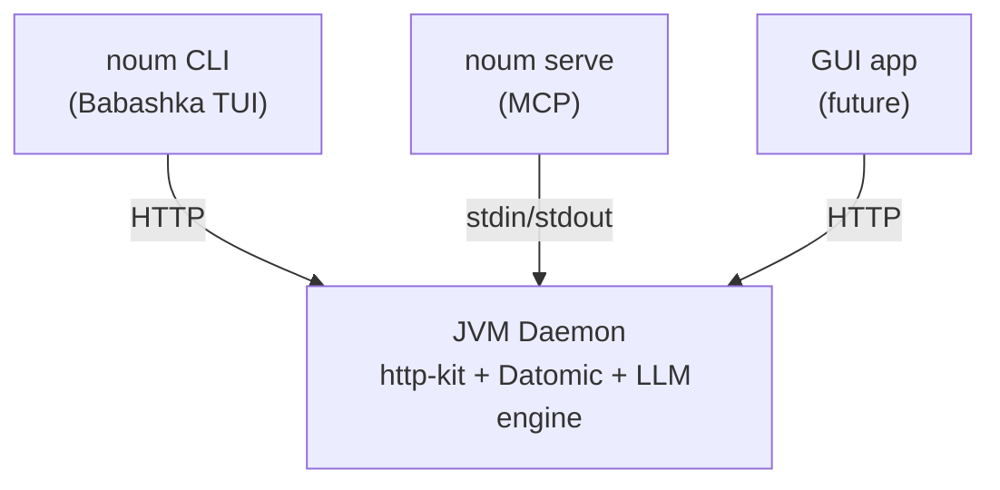

# Noumenon `noum`: Packaging & Delivery Overhaul

**Date:** 2026-03-29
**Operator:** Claude Opus 4.6 (automated)
**Branch:** `feat/noum-launcher` (32 commits, ~4,250 lines added across 43 files)
**Test suite:** 473 backend tests, 1,568 assertions, 0 failures, 0 errors + 126 E2E smoke tests
**Docker image:** 167MB (Alpine + custom jlink JRE)

---

## 1. The Problem

### 1.1 The Clojure CLI is a barrier

Noumenon distributed as a 350MB uberjar requiring JDK 21 and familiarity with the Clojure CLI (`clj -M:run`). For non-Clojure users — the majority of developers who might benefit from a codebase knowledge graph — this was confusing. The `clj -M:run import /path/to/repo` invocation presupposes knowledge of Clojure's deps.edn alias system, and the 350MB JAR download implied a heavyweight dependency chain that discouraged experimentation.

### 1.2 The goals

1. **One command to install**: `curl | bash` or `brew install`
2. **One command to use**: `noum import .` — no Java, Clojure, or JDK knowledge
3. **Zero visible dependencies**: JRE and backend downloaded automatically on first use
4. **100% Clojure stack**: no Go, Node, Python, or shell script dependencies
5. **Future-proof**: architecture supports a visual UI (GUI) later

### 1.3 The inspiration

Other knowledge graph tools deploy via Docker Compose with npm-based configuration wizards. While Docker is too heavy for a single-user CLI tool, the UX insight is right: users should interact with a simple launcher that manages infrastructure invisibly.

---

## 2. Design Decisions

### 2.1 Why Babashka

[Babashka](https://github.com/babashka/babashka) is a fast-starting Clojure interpreter that ships as a single binary. Since v1.12.215, it bundles [JLine3](https://github.com/jline/jline3) for terminal UI support. The key feature: `cat bb uber.jar > noum` produces a [self-contained executable](https://github.com/babashka/babashka/wiki/Self-contained-executable#self-contained-executable-from-uberjar-recommended) that runs without Babashka installed. This gives us:

- **~50ms startup** (vs ~3s for JVM cold start)
- **Single binary distribution** per platform
- **The entire launcher written in Clojure** — same language as the backend

The alternative (GraalVM native-image) was ruled out because Datomic Local relies heavily on reflection and dynamic class loading, which are fundamentally incompatible with GraalVM's closed-world assumption.

### 2.2 Why a custom TUI library

We evaluated [bblgum](https://github.com/lispyclouds/bblgum) (wraps Go's gum) and [charm.clj](https://github.com/TimoKramer/charm.clj) (Elm architecture on JLine3). Both were rejected:

- **bblgum** requires a Go binary dependency — violates the "100% Clojure" constraint
- **charm.clj** is a full Elm-architecture framework with ~15 components — overkill for our 6 components

The custom TUI library is ~200 lines total, built directly on JLine3 (bundled in Babashka). Six components: spinner, choose (menu), confirm, progress bar, style (ANSI), and table. Each is 20-40 lines. The TTY auto-detection (`System/console` + `CI` env check) ensures commands work in scripts and CI pipelines without interactive elements.

### 2.3 Why HTTP on localhost

The `noum` launcher needs to communicate with the JVM daemon. Three options were considered:

| Protocol | Pros | Cons |
|----------|------|------|
| HTTP on localhost | http-kit already a dep, debuggable with curl, SSE for streaming, cross-platform | Port allocation |
| Unix domain socket | No network exposure | Windows incompatible |
| Stdin/stdout (MCP) | Already exists | Cold start per command (~3s) |

HTTP won because: (a) http-kit is already a dependency, (b) `curl localhost:PORT/health` is invaluable for debugging, (c) the same API serves the future GUI, and (d) binding to `127.0.0.1` eliminates network exposure concerns.

### 2.4 Why the JAR shrank from 350MB to 16MB

`uncomplicate/neanderthal` and `uncomplicate/deep-diamond` were added to `deps.edn` for future GPU-accelerated ML training but were never imported anywhere in `src/`. They contributed CUDA, MKL, and OpenBLAS native libraries totaling ~334MB. Removing two lines from `deps.edn` was the highest-impact change in the entire project.

---

## 3. Architecture



Three frontends share one JVM backend:

1. **`noum` (Babashka TUI)** — the primary user interface. Talks to the daemon over HTTP. Manages JRE download, JAR download, and daemon lifecycle.
2. **`noum serve` (MCP)** — stdin/stdout JSON-RPC for Claude Desktop and Claude Code. Spawns the JVM directly (no daemon needed).
3. **GUI app (future)** — Visual frontend talking to the same HTTP API.

### 3.1 First-run experience

```
$ noum import .
Java runtime not found. Downloading JRE 21 (45MB)... done.
Downloading Noumenon v0.3.0 (16MB)... done.
Starting Noumenon daemon...
Importing /Users/leif/Code/myproject...
```

The JRE is downloaded from the Adoptium API to `~/.noumenon/jre/`. The JAR is downloaded from GitHub Releases to `~/.noumenon/lib/noumenon.jar`. The daemon writes `~/.noumenon/daemon.edn` with its port and PID. Subsequent commands connect instantly.

### 3.2 Unified versioning

All artifacts share a single version from `resources/version.edn`:

- JVM backend reads it via `util/read-version`
- Launcher reads it from its classpath (copied during build)
- Docker image contains the same JAR
- `/health` API returns it
- Homebrew/Scoop manifests derive it from the git tag

### 3.3 Secrets and API keys

LLM provider tokens (e.g., `NOUMENON_ZAI_TOKEN`) are resolved via environment variables first, with fallback to `~/.env` and the project `.env` file. The `noum` launcher inherits the parent shell's environment when spawning the daemon, so tokens set in the shell are automatically available. Docker deployments pass tokens via `-e` flags.

---

## 4. The CLI

Every command is one word, no hyphens. 30 commands organized into 8 groups:

| Group | Commands |
|-------|----------|
| Pipeline | `digest`, `import`, `analyze`, `enrich`, `update`, `watch` |
| Query | `ask`, `query`, `queries`, `schema`, `status` |
| Benchmark | `bench`, `results`, `compare` |
| Introspect | `introspect` |
| Admin | `databases`, `delete`, `reseed`, `history` |
| Setup | `setup`, `install`, `serve` |
| Daemon | `start`, `stop`, `ping`, `upgrade` |
| Other | `open`, `help`, `version` |

Notable UX improvements over the old CLI:
- `noum ask <repo> "question"` — question is a positional arg, not `-q`
- `noum databases` — not `list-databases`
- `noum schema` — not `show-schema`
- `noum bench` — not `benchmark`
- `noum delete <name>` — explicit subcommand, not `--delete` flag
- `noum setup desktop` / `noum setup code` — auto-configures MCP
- `noum install claude` — installs Claude Desktop and Code

Command validation is data-driven: each command declares `:min-args` in the registry, and the generic handler validates before starting the daemon.

---

## 5. HTTP Daemon API

22 REST-ish endpoints on `127.0.0.1`, returning structured JSON:

| Method | Path | Purpose |
|--------|------|---------|
| GET | `/health` | Daemon health + uptime |
| POST | `/api/import` | Import repository |
| POST | `/api/analyze` | LLM analysis |
| POST | `/api/enrich` | Import graph extraction |
| POST | `/api/update` | Sync with git |
| POST | `/api/digest` | Full pipeline |
| POST | `/api/ask` | AI-powered question |
| POST | `/api/query` | Named Datalog query |
| GET | `/api/queries` | List available queries |
| GET | `/api/schema/:repo` | Database schema |
| GET | `/api/status/:repo` | Entity counts |
| GET | `/api/databases` | List databases |
| DELETE | `/api/databases/:name` | Delete database |
| POST | `/api/benchmark` | Run benchmark |
| GET | `/api/benchmark/results` | Get results |
| GET | `/api/benchmark/compare` | Compare runs |
| POST | `/api/introspect` | Start introspection |
| POST | `/api/reseed` | Reload artifacts |
| GET | `/api/artifacts/history` | Artifact history |

The connection cache (`db/get-or-create-conn`) is shared between the HTTP and MCP layers, preventing Datomic lock conflicts when both run in the same JVM.

Bearer token authentication is supported for remote access (`--token` flag or `NOUMENON_TOKEN` env var, `--host` flag in CLI).

---

## 6. CI/CD Pipeline

### CI (every push to main)
- **Backend job**: lint, fmt, test, build JAR (Ubuntu)
- **Launcher job**: verify Babashka launcher loads and shows help

### Release (three tiers)

**Tier 1 — Dry run** (`workflow_dispatch` with `dry-run: true`):
Builds everything, publishes nothing. For validating the pipeline before tagging.

**Tier 2 — Pre-release** (`v*-rc*` tags, e.g., `v0.3.0-rc1`):
Full pipeline, creates a draft pre-release on GitHub. Docker image tagged without `latest`. Skips Homebrew/Scoop/Pages.

**Tier 3 — Release** (`v*` tags without `-rc`):
Full publish. Promote an rc by adding a final tag to the same commit.

| Job | Runners | Output |
|-----|---------|--------|
| Build JAR | Ubuntu | `noumenon-<version>.jar` |
| Build launcher | 5-platform matrix | `noum-{os}-{arch}` binaries |
| Integration test | macOS, Linux, Windows | Smoke tests on clean VMs |
| Release | Ubuntu | GitHub Release |
| Docker | Ubuntu | `ghcr.io/leifericf/noumenon` |
| Homebrew | Ubuntu | Auto-updated formula |
| Scoop | Ubuntu | Auto-updated manifest |
| Pages | Ubuntu | noumenon.leifericf.com |

The 5-platform matrix downloads the Babashka binary for each platform, builds a launcher uberjar, and concatenates them: `cat bb launcher-uber.jar > noum`. No compilation — each job runs in ~30 seconds.

### Distribution channels
- **GitHub Releases**: primary (all binaries + JAR)
- **Docker**: `ghcr.io/leifericf/noumenon` (167MB Alpine image)
- **Homebrew**: `brew install leifericf/noumenon/noumenon` (private tap, made public at launch)
- **Scoop** (Windows): `scoop install noumenon` (private bucket, made public at launch)
- **Installer script**: `curl -sSL https://noumenon.dev/install | bash`

---

## 7. Docker & Enterprise Deployment

### 7.1 Image optimization

The Docker image went through three iterations:

| Approach | Size | Base |
|----------|------|------|
| Full JRE | 457MB | `eclipse-temurin:21-jre` (Ubuntu 24.04) |
| Alpine JRE | 349MB | `eclipse-temurin:21-jre-alpine` |
| Custom jlink JRE | **167MB** | `alpine:3.21` + 7-module JRE |

The final image uses `jlink` to build a custom JRE containing only the modules Noumenon needs: `java.base`, `java.logging`, `java.naming`, `java.sql`, `java.xml`, `java.management`, and `jdk.unsupported`. The build stage uses `eclipse-temurin:21-jdk-alpine` so the jlink output is musl-compatible. Runtime dependencies are Alpine's `git` package (for repository imports).

### 7.2 Security hardening

- **Non-root execution**: runs as user `noumenon`, not root
- **Auth enforcement**: refuses to start with `--bind 0.0.0.0` unless `--token` or `NOUMENON_TOKEN` is set
- **Token via env var**: `NOUMENON_TOKEN` avoids leaking the token in `ps aux` process listings
- **File permissions**: `daemon.edn` written with owner-only read/write (600)
- **TLS warning**: logs a warning when network-accessible, recommending a reverse proxy

### 7.3 Data persistence

Datomic Local stores databases as files on disk. The [official backup approach](https://docs.datomic.com/datomic-local.html) is copying the database directory. For Docker, the data directory is a `VOLUME` mount:

```bash
docker run -d -p 7891:7891 \
  -e NOUMENON_TOKEN=<token> \
  -v /host/data:/data \
  ghcr.io/leifericf/noumenon
```

For enterprise deployments requiring full ACID durability, [Datomic Pro](https://www.datomic.com/get-datomic.html) (free) supports PostgreSQL and DynamoDB storage backends. The Noumenon codebase uses the same Datomic client API — switching is a configuration change, not a code change.

---

## 8. Test results

### Backend (JVM)
473 tests, 1,568 assertions, 0 failures, 0 errors. The shared connection cache (`db/get-or-create-conn`) resolved 2 pre-existing DB lock errors that existed prior to this branch.

### E2E smoke test (Babashka)
126 tests, 0 failures. Data-driven test runner covering:

| Group | Tests | Coverage |
|-------|-------|----------|
| Version | 2 | Version output |
| Help | 28 | Global + 12 subcommand help |
| Arg validation | 27 | 7 pipeline commands, ask, query, setup, install, watch, delete, history, unknown, no args |
| Ping (no daemon) | 2 | Exit code + message |
| Stop (no daemon) | 1 | Graceful exit |
| Setup code | 3 | Writes .mcp.json, validates content |
| Daemon lifecycle | 12 | Start, ping, databases, queries, import, status, stop, cleanup |
| MCP serve | 2 | JSON-RPC initialize handshake |
| Build binary | 8 | Uberjar build, concatenation, fresh binary smoke test |
| Docker CLI | 4 | --version and --help via Docker |
| Docker auth | 2 | Refuses 0.0.0.0 without token |
| Docker MCP | 2 | MCP serve via Docker container |
| Docker HTTP | 18 | Import, databases, status, schema, queries, query, ask validation, reseed, 404, wrong method, wrong token, non-root |
| Docker headless | 10 | Full lifecycle with auth, import, query |
| Docker --host | 1 | noum --host connects to Docker daemon |
| Docker SSE | 4 | SSE import: progress/result/done events |

Run: `bb test/noum/smoke_test.clj /path/to/noum`

### Docker integration
Full import of 317 commits via Docker container, auth enforcement verified, non-root execution confirmed, database persistence via volume mount tested.

---

## Appendix A: New files

| File | Purpose |
|------|---------|
| `src/noumenon/http.clj` | HTTP daemon: ring handler, 22 endpoints, auth, SSE streaming |
| `src/noumenon/sessions.clj` | Shared introspect session management for MCP and HTTP |
| `test/noumenon/http_test.clj` | HTTP handler unit tests |
| `launcher/src/noum/main.clj` | Launcher entry point, data-driven dispatch, HTTP client |
| `launcher/src/noum/cli.clj` | Command registry (30 commands), arg parser, grouped help |
| `launcher/src/noum/daemon.clj` | Daemon start/stop/connect, daemon.edn lifecycle |
| `launcher/src/noum/paths.clj` | Shared path constants for ~/.noumenon/ |
| `launcher/src/noum/jre.clj` | JRE auto-download from Adoptium API |
| `launcher/src/noum/jar.clj` | JAR auto-download from GitHub Releases |
| `launcher/src/noum/setup.clj` | MCP config for Claude Desktop/Code |
| `launcher/src/noum/install.clj` | Install Claude Desktop/Code |
| `launcher/src/noum/tui/core.clj` | TTY detection, stderr output |
| `launcher/src/noum/tui/spinner.clj` | Animated spinner |
| `launcher/src/noum/tui/choose.clj` | Menu selection with arrow/vim keys |
| `launcher/src/noum/tui/confirm.clj` | y/n confirmation |
| `launcher/src/noum/tui/progress.clj` | Progress bar with percentage |
| `launcher/src/noum/tui/style.clj` | ANSI colors, cursor control |
| `launcher/src/noum/tui/table.clj` | Column-aligned tables |
| `launcher/test/noum/smoke_test.clj` | 126-test E2E smoke test (Babashka) |
| `launcher/bb.edn` | Babashka build config |
| `launcher/resources/META-INF/bb.edn` | Self-contained binary classpath |
| `Dockerfile` | Multi-stage: Alpine + jlink JRE, non-root |
| `.dockerignore` | Exclude data, target, git, env from context |
| `bin/install.sh` | curl-pipe-bash installer |
| `docs/openapi.yaml` | Hand-written OpenAPI 3.1 spec for all 22 HTTP endpoints |

## Appendix B: Modified files

| File | Change |
|------|--------|
| `deps.edn` | Removed `uncomplicate/deep-diamond` and `uncomplicate/neanderthal` (350MB to 16MB) |
| `src/noumenon/db.clj` | Added shared `get-or-create-conn` with `conn-cache` atom |
| `src/noumenon/mcp.clj` | Delegated connection cache and introspect sessions to shared namespaces |
| `src/noumenon/cli.clj` | Added `daemon` command spec with `--bind` flag |
| `src/noumenon/main.clj` | Added `daemon` dispatch, `noumenon.http` require |
| `src/noumenon/analyze.clj` | Added `:progress-fn` callback to `analyze-repo!` |
| `src/noumenon/git.clj` | Added `progress-fn` arg to `import-commits!` |
| `src/noumenon/imports.clj` | Added `:progress-fn` to `enrich-repo!` opts |
| `src/noumenon/benchmark.clj` | Added `:progress-fn` to benchmark opts, called per question/layer |
| `src/noumenon/introspect.clj` | Added `:progress-fn` to `run-loop!` opts, called per iteration |
| `resources/version.edn` | Single source of truth for all artifact versions |
| `.github/workflows/ci.yml` | Added launcher CI job |
| `.github/workflows/release.yml` | 5-platform matrix, Docker, Homebrew/Scoop, Pages, dry-run, pre-release |
| `.gitignore` | Added launcher/target/, launcher/resources/version.edn |
| `CHANGES.md` | Added 0.3.0 (unreleased) entry |
| `README.md` | Rewritten for `noum` as primary interface, Docker section, data persistence |
| `CLAUDE.md` | Updated project commands table |
| `docs/index.html` | Updated terminal examples to `noum` commands, install section |

---

## 9. Resolved limitations

The following were originally listed as known limitations and have since been implemented:

- **SSE progress streaming** — All long-running HTTP endpoints (import, analyze, enrich, digest, benchmark, introspect) support SSE when the client sends `Accept: text/event-stream`. Core functions accept an optional `:progress-fn` callback. Falls back to blocking JSON without the header.
- **TUI progress bars** — The `noum` launcher reads SSE event streams and drives the TUI progress bar component in real-time for long-running commands. Non-interactive mode falls back to a spinner.
- **MCP progress notifications** — When the MCP client provides a `progressToken` in `_meta`, the server sends `notifications/progress` JSON-RPC messages during long-running tool calls. Claude Desktop and Claude Code render these as native progress indicators.
- **Introspect session sharing** — Extracted to `noumenon.sessions` namespace. An introspect run started via MCP can be monitored and stopped via the HTTP API (`noum` CLI), and vice versa.
- **`noum watch`** — Wired through the launcher via direct JVM spawn (like `serve`).
- **`noum delete` and `noum history`** — Wired through the launcher.
- **`--host` for remote backends** — `noum --host server:7891 --token abc status myrepo` connects to a remote daemon. Skips JRE/JAR download.

---

## 10. Known limitations

### 10.1 Windows process management

The `daemon.clj` module uses `kill -0` for process liveness checks, which is Unix-only. The `install.clj` module uses `where` on Windows but has not been manually tested.

---

## 11. Deployment notes

### TLS

The HTTP daemon does not implement TLS. This is by design — TLS termination belongs at the infrastructure layer:
- **Kubernetes**: Ingress controller (nginx, Traefik, Istio) handles TLS. Service mesh provides mTLS between pods.
- **Docker**: Reverse proxy (Caddy, nginx) in front of the container.
- **Corporate LAN**: Reverse proxy at the network edge.

The daemon handles authentication (bearer token). The infrastructure handles encryption.

---

## 12. Future directions

1. **GUI app** — `noum open` launches a visual knowledge graph explorer. The HTTP API is designed to support this from day one.
2. **Datomic Pro support** — Configuration switch for enterprise deployments with proper transactor and storage backend.
3. **Auto-generated OpenAPI spec** — The current hand-written `docs/openapi.yaml` should be auto-generated from route definitions (e.g. via reitit + ring-swagger).
4. **Remove legacy JVM CLI commands** — The subcommands in `src/noumenon/main.clj` (`import`, `analyze`, `query`, etc.) are no longer user-facing. All user interaction goes through `noum` (HTTP API) or `noum serve` (MCP). The only JVM entry points still needed are `serve` and `daemon`. The remaining CLI subcommands are kept as an internal development/debugging escape hatch (`clj -M:run import` from the REPL). Delete them once the `noum` launcher has been the exclusive interface for a full release cycle.
5. **Universal `<repo>` identifier** — All commands that accept `<repo>` should resolve any of: local filesystem path, database name (reverse lookup via `:repo/uri`), GitHub URL (auto-clone), or Perforce depot path (via git-p4). Currently database name resolution works for recently-imported repos; URLs only work in the JVM CLI's `do-import`. Unify in a shared resolution function used by both HTTP and MCP layers.
