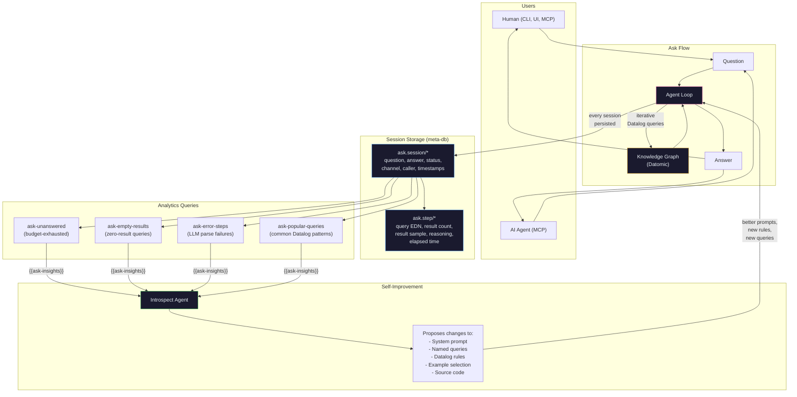

# Noumenon Visual UI: Electron + ClojureScript

**Date:** 2026-03-30
**Operator:** Claude Opus 4.6 (automated)
**Branch:** `feat/visual-ui` (119 commits → squashed to 8, ~8,530 lines added across 86 files)
**Test suite:** 475 backend tests + 50 CLJS unit tests (78 assertions) + E2E browser tests
**Frontend:** ClojureScript via shadow-cljs, 263 compiled files (including d3)

---

## 1. The Problem

### 1.1 CLI-only interface limits discovery

Noumenon's knowledge graph is queryable via CLI (`noum ask`, `noum query`) and MCP, but discovering what's *in* the graph — browsing schema, exploring relationships visually, monitoring pipeline progress — requires knowing the right commands and queries upfront. A visual interface enables open-ended exploration.

### 1.2 The goals

1. **Visual exploration** — browse the knowledge graph as a force-directed "star map"
2. **Ask anything** — natural-language search with formatted results
3. **Data quality control** — browse schema, run queries, inspect entities
4. **Pipeline management** — start/stop import/enrich/analyze with real-time progress
5. **Stateless, data-driven** — following Christian Johansen's philosophy

### 1.3 The inspiration

Christian Johansen's [stateless data-driven UIs](https://cjohansen.no/stateless-data-driven-uis/) — components are purely presentational, all state in a single atom, events are data vectors, ~30 lines of core machinery.

---

## 2. Design Decisions

### 2.1 Why Replicant

[Replicant](https://github.com/cjohansen/replicant) is Christian Johansen's latest rendering library — the successor to dumdom. It's a pure stateless renderer with native Hiccup support and zero dependencies. It deliberately excludes state management, making it the perfect match for the stateless UI philosophy. Portfolio (the component development tool) has a dedicated `portfolio.replicant` adapter.

### 2.2 Why Garden

CSS-in-Clojure via [Garden](https://github.com/noprompt/garden). Theme tokens are a plain Clojure map. Global styles are Garden data structures injected as a `<style>` element. Components use inline style maps in Hiccup.

### 2.3 Why Canvas for the graph

SVG is simpler but doesn't scale — 500+ nodes with force simulation causes janky rendering. Canvas provides direct pixel control and smooth 60fps animation. The tradeoff is that Canvas elements aren't DOM nodes (no CSS, no event delegation), so we handle hit-testing manually via d3-quadtree.

### 2.4 Why vanilla Electron main process

The Electron main process does three things: create a window, read `daemon.edn` to get the port, and pass it to the renderer. That's ~55 lines of JS. Writing this in ClojureScript via shadow-cljs `:node-script` target would add complexity for zero benefit.

---

## 3. Architecture

```
Electron
├── main.js (vanilla JS, ~55 lines)
│   └── reads ~/.noumenon/daemon.edn → port
└── Renderer (ClojureScript)
    ├── Single atom (app-state)
    ├── dispatch! (defmulti on action keyword)
    ├── Pure views: state → hiccup
    ├── Replicant: hiccup → DOM
    └── HTTP client: fetch + SSE ReadableStream
         │
         ▼
    Noumenon Daemon (JVM, http-kit, localhost:PORT)
```

**Data flow:** User interaction → event vector `[:action/foo arg]` → `dispatch!` → `swap! app-state` → Replicant re-renders.

**SSE streaming:** Uses `js/fetch` with `Accept: text/event-stream` + ReadableStream reader (not EventSource, which only supports GET — our SSE endpoints use POST).

---

## 4. Technology Stack

| Layer | Technology | Version |
|-------|-----------|---------|
| Renderer | Replicant | 2025.12.1 |
| CSS | Garden | 1.3.10 |
| Component dev | Portfolio | 2026.03.1 |
| Graph physics | d3-force | 3.x |
| Graph interaction | d3-zoom, d3-selection | 3.x |
| Desktop shell | Electron | 35.x |
| Build | shadow-cljs | 2.28.22 |

---

## 5. Views Implemented

### 5.1 Ask/Search
"Google-like" landing page with centered search bar. Database selector dropdown. Results rendered as formatted markdown with code block highlighting. Session history for follow-up questions.

### 5.2 Database Management
Table of databases from `/api/databases`. Action buttons for Import, Enrich, Analyze, Digest, Delete. Active SSE operations show inline progress bars with real-time updates.

### 5.3 Schema/Entity Browser + Query Workbench
Three-tab layout:
- **Queries** — Named query list with descriptions, parameter inputs, one-click execution
- **Schema** — Attributes grouped by namespace, filterable, with detail panel
- **Workbench** — Raw Datalog editor (textarea) for hand-written queries

New backend endpoint: `/api/query-raw` accepts EDN-encoded Datalog and executes against the database.

### 5.4 Graph Star Map
Force-directed graph of codebase files:
- Nodes colored by architectural layer (core, subsystem, driver, api, util)
- Nodes sized by churn count (from hotspots query)
- Three edge modes: imports, co-changes, and dependencies
- Canvas rendering for performance
- d3-zoom for pan/zoom
- Click-to-select with file detail panel
- Directory prefix and architectural layer filters
- Layer color legend

### 5.5 Benchmark
Run and monitor benchmarks with SSE progress. View results in a table with score badges (color-coded by quality). Select two runs and compare them side-by-side.

### 5.6 History
Commit timeline showing SHA, commit type (feat/fix/refactor badges), message, author, date, and diff stats (+/-). Uses the `recent-commits` named query.

### 5.7 Introspect
Start/stop autonomous self-improvement sessions with SSE progress. Status card shows current run state. Iteration history table with score deltas and action descriptions.

### 5.8 Add Repo
Text input in the databases view to import new repositories by path. Enter key or Import button triggers the SSE import flow.

---

## 6. Backend Changes

1. **CORS headers** — `Access-Control-Allow-*` on all responses, OPTIONS preflight handling
2. **`/api/query-raw`** — New endpoint accepting raw Datalog EDN strings
3. **`/api/query-as-of`** — New endpoint for Datomic time travel (d/as-of) with ISO-8601 or epoch ms
4. **`all-import-edges`** — New named query returning all file-to-file import edges
5. **`noum open`** — New launcher command: ensures daemon, launches Electron

---

## 7. Project Structure

```
ui/
├── deps.edn                     # ClojureScript deps (Replicant, Garden, Portfolio)
├── shadow-cljs.edn              # :app and :portfolio build targets
├── package.json                 # Electron, d3, shadow-cljs
├── electron/
│   ├── main.js                  # Minimal Electron main process
│   └── preload.js               # Context bridge
├── src/noumenon/ui/
│   ├── core.cljs                # Entry, Replicant mount, dispatch bridge
│   ├── state.cljs               # Atom, defmulti event handlers
│   ├── routes.cljs              # Hash-based routing
│   ├── http.cljs                # fetch, SSE, delete wrappers
│   ├── styles.cljs              # Garden theme tokens + global CSS
│   ├── views/
│   │   ├── shell.cljs           # App shell (sidebar + content)
│   │   ├── ask.cljs             # Ask/Search view
│   │   ├── databases.cljs       # Database management
│   │   ├── schema.cljs          # Schema browser + query workbench
│   │   ├── graph.cljs           # Star map graph view
│   │   ├── benchmark.cljs       # Benchmark management
│   │   └── history.cljs         # Commit timeline
│   ├── components/
│   │   ├── button.cljs, card.cljs, progress.cljs
│   │   ├── sidebar.cljs, table.cljs, badge.cljs
│   │   ├── input.cljs, markdown.cljs, toast.cljs, skeleton.cljs
│   └── graph/
│       ├── data.cljs            # Query results → nodes/edges
│       ├── force.cljs           # d3-force simulation
│       ├── render.cljs          # Canvas renderer
│       └── controls.cljs        # Zoom, pan, hit-testing
└── portfolio/scenes/            # Visual component scenes
```

---

## 8. Development Workflow

```bash
# Terminal 1: ClojureScript watch
cd ui && npx shadow-cljs watch app

# Terminal 2: Backend daemon
noum start

# Terminal 3: Electron (dev mode)
cd ui && npx electron .

# Portfolio (component gallery)
cd ui && npx shadow-cljs watch portfolio
# → http://localhost:8281/portfolio.html
```

---

## 9. Continued Work

### 9.1 Graph filters (directory prefix + architectural layer)

Added filter controls to the graph toolbar — a text input for directory prefix filtering and a dropdown for architectural layer. Filtering removes non-matching nodes and their edges from the simulation, then restarts it. The filter state lives in the atom at `:graph/filter-dir` and `:graph/filter-layer`.

### 9.2 Graph dependency edge mode

Added a third edge mode toggle: "Dependencies" (using the `dependency-hotspots` query). The mode selector in the toolbar now shows three buttons: Imports, Co-changes, Dependencies. Switching modes triggers a data refetch and simulation restart.

### 9.3 Loading skeletons and error toasts

- Loading skeletons: pulsing placeholder rectangles shown while data is loading in each view
- Error toasts: wired to state at `:toasts` — errors from HTTP calls automatically create toasts that auto-dismiss after 5 seconds
- Toast container rendered in the app shell, above all other content

### 9.4 Keyboard shortcuts

- `Cmd+K` / `Ctrl+K`: focus the ask search bar (navigates to Ask view if not already there)
- `Escape`: close detail panels, clear graph selection

### 9.5 Benchmark view

New view accessible from the sidebar — start/stop benchmarks, view results in a table, compare two runs side-by-side with score delta highlighting. Uses SSE streaming for real-time benchmark progress.

### 9.6 Production build

- `shadow-cljs release app` produces optimized JS with advanced compilation
- Electron main.js detects `app.isPackaged` and loads from `file://` instead of dev server
- `electron-builder` config added to `package.json` for macOS `.app` packaging

### 9.7 History view (commit timeline)

Commit timeline view showing SHA, commit type badges, message, author, date, and diff stats. Uses the `recent-commits` named query. A stepping stone toward full Datomic `as-of` time travel (which requires a new backend endpoint to expose Datomic's temporal queries via HTTP).

---

## 10. Commit Log (squashed)

| Commit | Description |
|--------|-------------|
| `4428af6` | Electron + ClojureScript visual UI foundation (14 original commits) |
| `626db59` | Security hardening and UX polish (15 original commits) |
| `098992f` | Synthesize: codebase-level architectural analysis (16 original commits) |
| `b4aa7f5` | noum demo: pre-built demo database download (13 original commits) |
| `331fed7` | Three-level drill-down graph with component cards (11 original commits) |
| `fca07b6` | Accessibility, keyboard nav, and interaction polish (24 original commits) |
| `f1557df` | Graph node styling, layout, and visual refinement (17 original commits) |
| `0757422` | Markdown parser, clipboard, and agent step display (9 original commits) |

### UX Review (30 issues found and fixed)

A thorough automated UX review identified 5 critical, 10 major, and 15 minor issues. All 30 were fixed:

**Critical:** Dead graph init code removed (conflicting init paths, undefined `window.__noumenon_dispatch`, wrong `draw!` signature), canvas background hardcoded to dark theme, SSE parser dropping events at network chunk boundaries.

**Major:** Ask/graph loading stuck permanently when no DB selected, toast without dismiss button, schema/query panels with no empty states, benchmark compare as raw `pr-str`.

**Minor:** Focus indicators (WCAG 2.4.7), theme not persisted to localStorage, markdown heading hierarchy off-by-one, progress bar "N/nil", `(name nil)` crash, `clojure.core/name` usage, DB selector missing placeholder, Electron daemon auto-start.

### Second UX Review (23 more issues found and fixed)

A second pass found 5 critical, 8 major, and 10 minor issues:

**Critical:** Canvas event listeners stacking on graph re-init (memory leak), d3-zoom behaviors stacking, SSE streams with no cancellation (AbortController added), `on-done` firing twice per SSE operation (compare-and-set! guard added).

**Major:** Routes bypassing dispatch! with direct atom swap (fixed), query history doing atom deref inside dispatch handler (now uses value directly), unkeyed `for` sequences causing O(n) DOM diffs (keys added everywhere), stale canvas closure in draw-fn (reads ref atom now), dead `::row-click` dispatch in table component (removed).

**Minor:** Blocking `execSync('sleep')` in Electron startup (async polling), inconsistent markdown return type (always vector now), magic `48px` height constant (replaced with 100%), HTTP client silently swallowing status codes (now checks `resp.ok`).

### Hybrid Settings System

Two-layer persistence for user settings:

**Layer 1: `~/.noumenon/config.edn`** — Connection bootstrap (backends list, active backend). Read by Electron main process and Babashka CLI before any backend connection exists. Format:
```clojure
{:backends [{:name "Local" :url "auto" :token nil}
            {:name "Dev" :url "https://dev:9876" :token "env:DEV_TOKEN"}]
 :active-backend "Local"}
```

**Layer 2: Datomic meta-db `:setting/*`** — User preferences (theme, sidebar state, query history, default database). Identity-based upsert with EDN values. Gets Datomic history for free.

**API endpoints:** `GET/POST /api/settings` stores instance-level preferences in Datomic. Backends are managed client-side only — a remote instance cannot read the user's local config.edn.

**Backend switcher:** Dropdown in sidebar footer. Switching updates `http/connection` atom (URL + auth token), persists to config.edn via Electron IPC, and refreshes database list.

**Multi-instance model:** Each Noumenon instance is independent and self-contained. Clients connect to one or more instances using a URL + bearer token. No accounts, no login, no central registry. Like connecting to a database — the instance operator shares credentials out-of-band.

### Ask Session Persistence and Self-Improvement Loop

Every question asked through any channel is persisted in the internal Datomic meta-db with full step traces. The introspect agent reads this data to find gaps and optimize itself.



**Why we built this:** The ask feature is Noumenon's core value proposition — "ask anything about your codebase." But without observability, we can't know what questions users actually ask, where the system fails, or what's missing from the data model. By persisting every session with full step traces, we create a feedback signal that the introspect agent can act on autonomously.

**What it enables:**
- **Gap discovery:** `ask-empty-results` and `ask-schema-gaps` reveal attributes the LLM tries to query that don't exist or have no data — direct signals for what to add to the schema or analysis pipeline.
- **Query optimization:** `ask-popular-queries` shows which Datalog patterns the LLM writes most often. If a pattern appears 50 times, it should be a named query with an optimized description in the system prompt.
- **Failure analysis:** `ask-unanswered` shows questions the system couldn't answer at all. Combined with the step traces showing what was tried, the introspect agent can propose specific fixes — new rules, better prompts, or additional data.
- **Cost tracking:** `ask-token-cost` and `ask-by-caller` show how much LLM spend goes to human vs AI agent usage, across channels.

The key insight: the system improves by watching itself fail, not just by running benchmarks. Real user questions are a higher-quality signal than synthetic benchmarks because they reflect what people actually need.

### Rich Reasoning Trace

The Ask view now shows a captivating step-by-step reasoning trace while the agent works:

- Each step slides in with a fade animation as it completes
- Green dots for completed steps, blue for thinking states
- Elapsed time badges per step (e.g. "2.3s")
- Result count badges (e.g. "42 results")
- LLM's reasoning text shown in italic — the agent "thinking aloud"
- Sample data pills showing example results from each query
- Spinning indicator for the active step
- "Reasoning" header with timeline-style layout

The backend sends rich structured data per iteration: step type, human-friendly description, reasoning excerpt, result count, sample rows, and elapsed time.

### Conversation History from Datomic

Past ask sessions are loaded from the internal meta-db and displayed below the search bar:

- Click a past session to expand: see the full answer and step trace
- Thumbs up/down feedback buttons (persisted to Datomic via `:ask.session/feedback`)
- Optional feedback comment for qualitative signal
- "Ask again" button to re-ask a past question after improvements
- Status badges: only shown for incomplete/error sessions, not for normal answered ones
- Time-ago labels, channel indicators, step counts, duration

Negative feedback is surfaced as HIGHEST PRIORITY in the introspect meta-prompt.

### Suggested Questions

On the empty state (before any question is asked), the Ask view shows suggestion chips:

- Mix of common useful questions ("What are the most complex files?", "Who are the top contributors?")
- Past successful questions from the user's own history
- Click a chip to populate the search bar

### @-Mention Autocomplete

Type `@` anywhere in the question to trigger inline typeahead autocomplete:

- Searches 6 entity types: commits (partial SHA or message keywords), code segments (functions/types), named queries, authors, files, directories
- Results ordered by specificity: commits first, then segments, queries, authors, files, dirs
- Keyboard navigation: arrow keys + Enter to select, Escape to dismiss
- Selected entity inserted inline as `@src/noumenon/http.clj`
- On submit, `@`-mentions extracted and appended as explicit `Referenced entities:` context for the agent
- Completion source data cached per-repo with 60s TTL
- UI debounces fetch at 150ms to avoid per-keystroke requests
- Commit results show message preview alongside truncated SHA

### Bug Fixes from Live Testing

Issues discovered during hands-on browser testing:

- **SSE CORS**: `with-sse` bypassed the CORS wrapper; fixed by adding headers to SSE initial response
- **resolve-repo**: bare database names without stored `:repo/uri` caused "Repository not found" errors; now falls back to checking database directory directly
- **Markdown renderer**: nested hiccup vectors rendered as text; fixed with `into` to splice children
- **Benchmark/Introspect stuck loading**: error responses didn't clear `loading?` flag; added error handlers
- **History column order**: destructuring didn't match query result order; fixed to `[sha message author kind date added deleted]`
- **Status badges**: JSON string status vs keyword mismatch; now handles both

### Single-Page Layout (v1 Pivot)

Major restructure: combined Ask + Graph into a single page. The graph fills the entire viewport as an ambient background; Ask floats on top as a semi-transparent glass overlay.

**What was removed from the initial view:**
- Sidebar navigation and all routing
- Databases, Schema, Benchmark, Introspect, History views (code kept, just not rendered — available for future admin UI)
- Theme toggle, backend switcher (deferred to settings)

**Deep Space Graph Renderer:**
- Nodes rendered as glowing stars with canvas radial gradients (bright center → color → transparent edge)
- Larger/more important nodes get an outer glow ring
- Edges as faint lines between connected files
- Ambient breathing: nodes oscillate brightness on offset sin waves (8-15s periods)
- Refined space color palette: blue (core), emerald (subsystem), amber (driver), pink (API), slate (util)
- Dark space background: `#0a0e17`
- Performance optimized: dim nodes use fast plain circles, only prominent nodes get gradient treatment; edges batched into single canvas path

**Answer-Scoped Graph Focus:**
- After an answer, file paths extracted from reasoning step results and answer text
- Matched files glow at full intensity; everything else dims to 12%
- Each reasoning step has a "graph" link to focus on just that step's results
- Starting a new question clears focus
- Click a graph node → `@file-path` pre-filled in search bar

**Three Layers of Detail:**
1. Text answer — concise 2-3 sentence insight
2. Graph focus — visual exploration of referenced entities
3. CSV download — "↓ csv" link on steps with >5 results, in-browser Blob download

**Floating Node Info Cards:**
- Click a graph node → frosted-glass card appears near the click position
- Shows: file path, architectural layer badge, complexity badge, commit count
- LLM-generated summary of what the file does
- Recent commit messages, imports, importers, authors
- Card scrollable (max-height 70vh), dismisses on click elsewhere or Escape

**UX Polish:**
- Suggestion ticker: horizontal scrolling carousel of 42 curated questions from benchmark catalog, click to run immediately, hover to pause
- Collapsible "Previous questions" section with pagination
- Reasoning trace: newest steps on top, older fade at bottom, expand/collapse
- "Ask another question" link to clear and start fresh
- Inline feedback: "Could be better?" opens comment box, saved to Datomic
- Graph stability: weaker forces, faster cooldown, no competing redraw loops
- Ask overlay scrollable for long answers

---

## 11. Remaining Work

- [ ] **Graph legend** — Subtle indicator explaining dot sizes (churn) and colors (architectural layer)
- [ ] **Hover-brightens-edges** — Hovering a node brightens its connected edges to show why nodes are near each other
- [ ] **Batch import/enrich** — CLI command to update+enrich all databases at once
- [ ] **Babashka CLI parity** — Settings and backend management via `noum` CLI commands
- [ ] **Instance discovery** — `.well-known/noumenon.json` convention for broadcasting instance existence
- [ ] **Accessibility** — ARIA labels, keyboard navigation
- [ ] **Windows packaging** — electron-builder NSIS target
- [ ] **Admin views** — Restore Databases, Schema, Benchmark views behind a settings/admin menu
- [ ] **Parallel sub-agents for Ask** — Decompose complex multi-part questions into concurrent sub-agents. Prerequisite: metrics showing which question types are slow and decomposable.
- [ ] **Introspect self-analysis** — Store causal analysis of why each introspect change worked or failed, so future runs learn from meta-history.
- [ ] **Question routing / agent specialization** — Classify questions by type (architecture, bugs, ownership) and route to specialized prompts. Requires usage data showing distinct question clusters.
- [ ] **Cross-repo learning** — Identify successful query strategies that transfer across repos (e.g. "bus factor" works the same everywhere). Build a shared strategy corpus.
- [ ] **Adversarial self-testing** — Agent that asks hard questions based on reflection data to stress-test weaknesses before users hit them.
- [ ] **Reflection → schema → re-analysis cycle** — Introspect proposes schema additions from agent reflections, triggers re-analysis with updated prompts, new data appears, answers improve. The system adds capabilities driven by what users actually need.

---

## 12. Agent Self-Reflection Feedback Loop

Added a structured feedback mechanism where the ask agent reports what it learned about the data during each session. This closes the loop between "the agent tried to answer" and "the system knows what to improve."

### How It Works

The agent now has a `:reflect` tool alongside `:query`, `:schema`, `:rules`, and `:answer`. When emitting its final answer, the agent also emits a reflection:

```clojure
[{:tool :reflect :args {:missing-attributes ["function-level dependency graph"
                                              "test-to-source file mapping"]
                         :quality-issues ["some commit messages are empty strings"
                                          "author emails inconsistent across repos"]
                         :suggested-queries ["files by cyclomatic complexity"
                                             "test coverage per source file"]
                         :notes "The schema has file-level analysis but no function-level granularity."}}
 {:tool :answer :args {:text "Based on the available data..."}}]
```

### What Gets Stored

Per-session in Datomic (internal meta-db):
- `:ask.session/missing-attributes` — EDN vector of data model gaps
- `:ask.session/quality-issues` — EDN vector of data quality problems
- `:ask.session/suggested-queries` — EDN vector of query suggestions
- `:ask.session/agent-notes` — free-text observations

### How Introspect Uses It

The `{{ask-insights}}` section in the introspect meta-prompt now includes three new subsections aggregated by frequency across all sessions:

1. **Data Gaps Reported by Agents** — "function dependencies (reported 10x)" → signals for schema additions
2. **Data Quality Issues** — "empty commit messages (reported 7x)" → signals for import/analysis fixes
3. **Named Queries Suggested by Agents** — "files by test coverage (suggested 8x)" → candidates for new pre-built queries

### The Full Feedback Loop

```
User asks question
  → Agent queries knowledge graph
  → Agent reflects: "I needed X but it doesn't exist, Y had bad data"
  → Reflection stored in Datomic
  → User optionally rates answer ("Could be better?")
  → Introspect reads: reflections + feedback + empty results + popular patterns
  → Proposes improvement: new schema attribute, better prompt, new named query
  → System improves
  → Next user gets better answer
```

### Named Queries for Developers

- `ask-missing-attributes` — What agents say is missing from the data model
- `ask-quality-issues` — Data quality problems agents have observed
- `ask-suggested-queries` — Named queries agents wish existed
- `ask-agent-reflections` — Full reflection data from recent sessions
